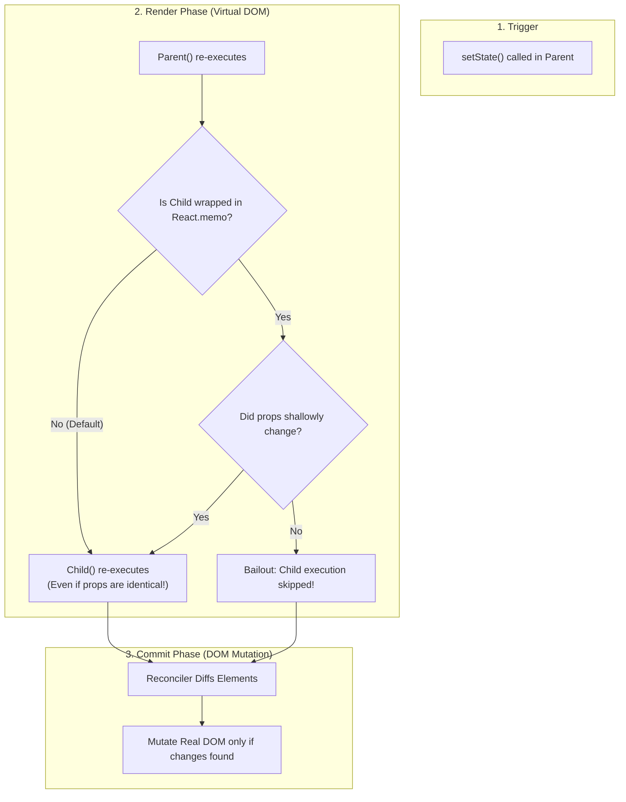

<div className="flex gap-2 mb-4">
  <Badge color="green" size="sm">React 18 &amp; 19</Badge>
  <Badge color="blue" size="sm">Core Architecture</Badge>
  <Badge color="purple" size="sm">High-Yield Interview Topic</Badge>
</div>

<Card title="30-Second Senior Interview Pitch" icon="microphone">
  In React, a component re-renders for exactly two natural reasons: its internal state changed, or its parent component re-rendered. The widespread belief that 'a component re-renders because its props changed' is completely false! When a parent re-renders, all child components re-render by default regardless of whether their props changed at all. The simplest, most powerful way to stop unnecessary re-renders without using React.memo is moving state down into an isolated leaf component.
</Card>

## Under The Hood (Fiber Engine & Architecture)



- <Tooltip tip="Pure JavaScript calculation phase where component functions execute and return React Element trees">Render Phase</Tooltip>: When setState is called, React schedules a re-render. It executes the component function from top to bottom, returning a new tree of React Element objects (plain JavaScript objects with type and props).
- <Tooltip tip="Double-buffered tree of Fiber nodes representing component instances, hooks, and DOM nodes">Fiber Tree Traversal</Tooltip>: React traverses down the Fiber tree starting from the component where state changed. By default, it continues calling all child component functions recursively, generating their new React elements.
- Busting the Myth: React does NOT inspect props to decide if a child should re-render. Unless a child is wrapped in `React.memo`, React always executes the child function when the parent renders.
- <Tooltip tip="Synchronous phase where React writes changes to the real browser DOM and fires layout effects">Commit Phase</Tooltip>: After calculating the new virtual DOM tree, React diffs it against the previous tree. Only the actual changed DOM nodes are mutated in the real browser DOM. However, executing expensive child render functions in JavaScript can still cause serious main-thread UI lag!
- <Tooltip tip="Optimization where React skips rendering a Fiber node when props and state have not changed">Bailout</Tooltip>: If a component is memoized and its props pass an `Object.is` shallow equality check, React bails out of rendering that entire subtree.
- The Danger of Custom Hooks: Custom hooks share stateful logic, not state itself. Any state update inside a custom hook triggers a re-render of the host component where that hook is invoked, potentially re-rendering a massive subtree unintentionally.

## Implementation Patterns & Approaches

<CodeGroup>
```tsx Pattern A: Moving State Down Recommended
// ✅ Move state into an isolated leaf
function ModalTrigger() {
  const [isOpen, setIsOpen] = useState(false);
  return (
    <>
      <button onClick={() => setIsOpen(true)}>Open Modal</button>
      {isOpen && <ModalDialog onClose={() => setIsOpen(false)} />}
    </>
  );
}

function Page() {
  return (
    <div>
      <ModalTrigger />
      <VeryExpensiveTree /> {/* Never re-renders when modal toggles! */}
    </div>
  );
}
```

```tsx Pattern B: Component Memoization React.memo
const MemoizedExpensiveTree = React.memo(VeryExpensiveTree);

function Page() {
  const [isOpen, setIsOpen] = useState(false);
  return (
    <div>
      <button onClick={() => setIsOpen(true)}>Open Modal</button>
      {isOpen && <ModalDialog onClose={() => setIsOpen(false)} />}
      <MemoizedExpensiveTree />
    </div>
  );
}
```

</CodeGroup>

### Pattern A: Moving State Down (Recommended) (Best Practice)

Extract the volatile state (e.g. modal open/close, input keystrokes) into its own dedicated small leaf component. The heavy parent becomes pure and never re-renders.

**Advantages & When to Use:**
- Zero memoization overhead (no useMemo/useCallback needed)
- 100% natural React architecture
- Clean separation of concerns

**Tradeoffs & Watch Out For:**
- Requires decomposing components into smaller files

### Pattern B: Component Memoization (React.memo) (Traditional Alternative)

Keep state in the parent, but wrap the expensive child with React.memo so React does shallow prop comparison before executing it.

**Advantages & When to Use:**
- Allows state to remain at the parent level if needed

**Tradeoffs & Watch Out For:**
- Requires all passed props (callbacks, objects) to be wrapped in useCallback and useMemo
- Fragile: any unmemoized inline object or arrow function breaks React.memo immediately
- Adds memory and comparison overhead to every render

## Pitfalls & Anti-Patterns

### ⚠️ Anti-Pattern: Hoisting Volatile State to the Parent Container

<Warning>
  **Why It Breaks:** Every keystroke updates search state at the Dashboard root. React re-executes Dashboard, which immediately re-executes HeavyAnalyticsChart and HugeTransactionsTable on every single keypress, freezing the typing thread.
</Warning>

<CodeGroup>
```tsx Buggy Code
function Dashboard() {
  const [search, setSearch] = useState(''); // Volatile state

  return (
    <div>
      <input value={search} onChange={e => setSearch(e.target.value)} />
      <HeavyAnalyticsChart />  {/* Re-renders on every keystroke! */}
      <HugeTransactionsTable /> {/* Re-renders on every keystroke! */}
    </div>
  );
}
```

```tsx Senior Solution
function SearchBar({ onSearch }: { onSearch: (val: string) => void }) {
  const [text, setText] = useState('');
  return (
    <input
      value={text}
      onChange={e => setText(e.target.value)}
      onKeyDown={e => e.key === 'Enter' && onSearch(text)}
    />
  );
}

function Dashboard() {
  const [query, setQuery] = useState('');
  return (
    <div>
      <SearchBar onSearch={setQuery} />
      <HeavyAnalyticsChart query={query} />
      <HugeTransactionsTable query={query} />
    </div>
  );
}
```
</CodeGroup>

<Tip>
  **Senior Explanation:** By pushing local keystroke state into SearchBar, typing is instantaneous at 60fps. The heavy charts and tables only re-render when the user actually submits or debounces the search query.
</Tip>

### ⚠️ Anti-Pattern: The Hidden Custom Hook Re-render Cascade

<Warning>
  **Why It Breaks:** Custom hooks are not isolated background workers. They execute in the context of the component calling them. Updating state inside useScrollPosition forces BigPage and all its descendants to re-render 60 to 120 times per second.
</Warning>

<CodeGroup>
```tsx Buggy Code
// Custom hook that tracks window scroll
function useScrollPosition() {
  const [pos, setPos] = useState(0);
  useEffect(() => {
    const handleScroll = () => setPos(window.scrollY);
    window.addEventListener('scroll', handleScroll);
    return () => window.removeEventListener('scroll', handleScroll);
  }, []);
  return pos;
}

// ❌ Calling it at the top of a big component
function BigPage() {
  const scroll = useScrollPosition(); // Re-renders BigPage on EVERY pixel scroll!
  return (
    <div>
      <Header />
      <ScrollIndicator position={scroll} />
      <HugeBodyContent /> {/* Re-renders hundreds of times per second! */}
    </div>
  );
}
```

```tsx Senior Solution
// ✅ Move the hook call into the leaf that actually needs it!
function ScrollIndicator() {
  const scroll = useScrollPosition();
  return <div style={{ width: `${scroll}px` }} className="progress-bar" />;
}

function BigPage() {
  // BigPage has no scroll listener state!
  return (
    <div>
      <Header />
      <ScrollIndicator />
      <HugeBodyContent /> {/* Completely protected from scroll re-renders */}
    </div>
  );
}
```
</CodeGroup>

<Tip>
  **Senior Explanation:** Never call high-frequency stateful hooks (scroll, resize, mouse move) at the top of a large page component. Encapsulate the hook inside the specific leaf component that visually consumes that data.
</Tip>

## Senior Interview Q&A

<AccordionGroup>
  <Accordion title="Q: True or False: A React component only re-renders when its props change. Explain why. (Common Level)">
    False! This is the most common misconception in React interviews. By default, when a parent component re-renders, React re-renders ALL of its children recursively, regardless of whether their props changed, stayed the same, or if they have no props at all. The only way to stop a child from re-rendering when its parent re-renders is wrapping it in React.memo (or passing it as pre-rendered children/props).
  </Accordion>
  <Accordion title="Q: What is 'moving state down' and why is it preferred over React.memo? (Tricky Level)">
    Moving state down is a composition pattern where volatile, frequently changing state (like input text, modal open/close, hover state) is pushed down into the lowest possible component in the tree that actually uses it. It is preferred over React.memo because it requires zero memoization boilerplate, avoids useCallback/useMemo dependency maintenance, eliminates shallow comparison CPU overhead, and is naturally immune to broken prop references.
  </Accordion>
  <Accordion title="Q: What is the danger of using custom hooks for performance? (Senior Level)">
    Custom hooks share stateful logic, not state instances. When a hook updates its internal state, it triggers a re-render of the specific component that invoked the hook. If an engineer invokes a hook with rapid state updates (e.g. scroll tracking, mouse move, web socket messages) in a high-level container component, it creates a massive re-render cascade across the entire page.
  </Accordion>
</AccordionGroup>

## Complete Playground Component

<CodeGroup>
```tsx 01-intro-to-rerenders.tsx
import React, { useState } from 'react';
import { RenderCounter } from '../../../components/ui/RenderCounter';

// Very heavy expensive component that simulates complex UI
const ExpensiveTree: React.FC<{ label: string }> = ({ label }) => {
  return (
    <div className="border border-stone-200 dark:border-stone-800 p-4 bg-stone-100/60 dark:bg-stone-900/60 space-y-2">
      <div className="flex items-center justify-between">
        <span className="text-xs font-mono font-medium text-stone-900 dark:text-stone-50">
          {label} (Expensive Subtree)
        </span>
        <RenderCounter name={label} />
      </div>
      <p className="text-xs text-stone-500 max-w-[50ch]">
        Simulates 500 table rows, SVG charts, or a heavy data grid. If its
        parent re-renders, this component re-renders unless isolated!
      </p>
    </div>
  );
};

// ❌ Anti-pattern: Volatile state lives inside the big container
const UnoptimizedModalContainer: React.FC = () => {
  const [isOpen, setIsOpen] = useState(false);
  const [inputValue, setInputValue] = useState('');

  return (
    <div className="border border-[#C8102E]/30 bg-[#C8102E]/5 p-5 space-y-4">
      <div className="flex items-center justify-between">
        <span className="text-xs font-mono text-[#C8102E] font-medium uppercase tracking-wider">
          ❌ Unoptimized: State at Parent Level
        </span>
        <RenderCounter name="ParentContainer" />
      </div>
      <p className="text-xs text-stone-600 dark:text-stone-400">
        Typing in this input or opening modal causes the whole parent to
        re-render, forcing ExpensiveTree to re-render on every keystroke!
      </p>

      <div className="flex items-center gap-3">
        <input
          type="text"
          value={inputValue}
          onChange={(e) => setInputValue(e.target.value)}
          placeholder="Type here (forces parent re-render)…"
          className="border border-stone-300 dark:border-stone-700 bg-stone-50 dark:bg-stone-950 px-3 py-1.5 text-xs text-stone-900 dark:text-stone-50 outline-none focus:border-[#C8102E] w-64"
        />
        <button
          onClick={() => setIsOpen(!isOpen)}
          className="px-3 py-1.5 bg-stone-900 dark:bg-stone-50 text-stone-50 dark:text-stone-900 text-xs font-medium"
        >
          {isOpen ? 'Close Modal' : 'Open Modal'}
        </button>
      </div>

      {isOpen && (
        <div className="p-3 border border-stone-300 dark:border-stone-700 bg-stone-200/50 dark:bg-stone-800/50 text-xs">
          Dialog state is active.
        </div>
      )}

      {/* Expensive child suffers from parent's re-render */}
      <ExpensiveTree label="UnoptimizedChild" />
    </div>
  );
};

// ✅ Senior Pattern: Moving State Down into a dedicated leaf component
const IsolatedModalButton: React.FC = () => {
  const [isOpen, setIsOpen] = useState(false);
  const [inputValue, setInputValue] = useState('');

  return (
    <div className="space-y-3">
      <div className="flex items-center justify-between">
        <span className="text-xs font-mono text-emerald-600 dark:text-emerald-400 font-medium">
          Isolated Leaf Component (Owns State)
        </span>
        <RenderCounter name="IsolatedLeaf" />
      </div>
      <div className="flex items-center gap-3">
        <input
          type="text"
          value={inputValue}
          onChange={(e) => setInputValue(e.target.value)}
          placeholder="Type here (only leaf re-renders!)…"
          className="border border-stone-300 dark:border-stone-700 bg-stone-50 dark:bg-stone-950 px-3 py-1.5 text-xs text-stone-900 dark:text-stone-50 outline-none focus:border-emerald-500 w-64"
        />
        <button
          onClick={() => setIsOpen(!isOpen)}
          className="px-3 py-1.5 bg-[#C8102E] text-stone-50 text-xs font-medium"
        >
          {isOpen ? 'Close Modal' : 'Open Modal'}
        </button>
      </div>
      {isOpen && (
        <div className="p-3 border border-stone-300 dark:border-stone-700 bg-stone-200/50 dark:bg-stone-800/50 text-xs">
          Dialog state is active.
        </div>
      )}
    </div>
  );
};

const OptimizedContainer: React.FC = () => {
  return (
    <div className="border border-emerald-500/30 bg-emerald-500/5 p-5 space-y-4">
      <div className="flex items-center justify-between">
        <span className="text-xs font-mono text-emerald-700 dark:text-emerald-400 font-medium uppercase tracking-wider">
          ✅ Optimized: State Moved Down
        </span>
        <RenderCounter name="OptimizedParent" />
      </div>
      <p className="text-xs text-stone-600 dark:text-stone-400">
        Parent has no volatile state. The input and modal state live inside
        their own leaf component. ExpensiveTree NEVER re-renders!
      </p>

      <IsolatedModalButton />

      {/* Expensive child remains completely untampered */}
      <ExpensiveTree label="ProtectedChild" />
    </div>
  );
};

export default function IntroToRerendersDemo() {
  const [activeMode, setActiveMode] = useState<'unoptimized' | 'optimized'>(
    'unoptimized'
  );

  return (
    <div className="space-y-6">
      {/* Interactive Scenario Toggle */}
      <div className="flex items-center gap-3 pb-3 border-b border-stone-200 dark:border-stone-800">
        <span className="text-xs font-mono uppercase tracking-wider text-stone-500">
          Select Investigation Scenario:
        </span>
        <button
          onClick={() => setActiveMode('unoptimized')}
          className={`px-3 py-1.5 text-xs font-mono uppercase tracking-wider border transition-colors ${
            activeMode === 'unoptimized'
              ? 'border-[#C8102E] bg-[#C8102E]/10 text-[#C8102E] font-medium'
              : 'border-stone-200 dark:border-stone-800 text-stone-500 hover:text-stone-900 dark:hover:text-stone-100'
          }`}
        >
          ❌ Unoptimized (Laggy Parent State)
        </button>
        <button
          onClick={() => setActiveMode('optimized')}
          className={`px-3 py-1.5 text-xs font-mono uppercase tracking-wider border transition-colors ${
            activeMode === 'optimized'
              ? 'border-emerald-500 bg-emerald-500/10 text-emerald-700 dark:text-emerald-400 font-medium'
              : 'border-stone-200 dark:border-stone-800 text-stone-500 hover:text-stone-900 dark:hover:text-stone-100'
          }`}
        >
          ✅ Optimized (Moving State Down)
        </button>
      </div>

      {activeMode === 'unoptimized' ? (
        <UnoptimizedModalContainer />
      ) : (
        <OptimizedContainer />
      )}
    </div>
  );
}
```
</CodeGroup>
