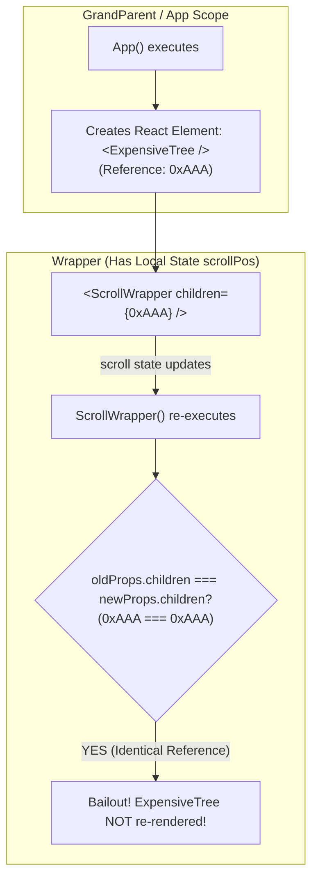

<div className="flex gap-2 mb-4">
  <Badge color="green" size="sm">React 18 & 19</Badge>
  <Badge color="blue" size="sm">Composition Pattern</Badge>
  <Badge color="purple" size="sm">Bypass Re-renders</Badge>
</div>

<Card title="30-Second Senior Interview Pitch" icon="microphone">
  A React Component is a function, while a React Element is the plain object returned by `React.createElement(&#123; type, props &#125;)`. When you write `<Child />`, you are creating an element object. If you instantiate `<Child />` inside a component body, a brand new element object is created on every single render. But if you pass `<Child />` as a `children` prop from an outer parent, the outer parent creates the element object once. When the inner wrapper re-renders due to its local state, the `children` prop reference remains completely unchanged, so React skips re-rendering the children! This is the classic 'Lifting Content Up' composition pattern.
</Card>

## Under The Hood (Fiber Engine & Architecture)



- Elements are Immutable Objects: JSX transpile turns `` into React.createElement("div"). It is a lightweight description of the UI, not an active DOM node or instance.
- Reconciliation Check: During reconciliation of a Fiber node, React checks: `if (oldProps.children === newProps.children)`. If referential equality is true and the child itself did not receive a state update, React completely bails out of re-rendering that child subtree!
- Where JSX is evaluated determines re-renders: If `` is evaluated inside ParentA, it gets created when ParentA renders. If ParentB is a child of ParentA and receives `{children}`, when ParentB re-renders from internal state, it does NOT re-evaluate ParentA, meaning `children` reference is 100% identical.
- Zero Memory / CPU Cost: Unlike React.memo which executes shallow comparison on all props and preserves memo cache, the children pattern costs zero extra runtime logic—it is native to React Fiber reconciliation.

## Implementation Patterns & Approaches

<CodeGroup>
```tsx Pattern A: The Children Prop Lifting Content Up
function ScrollableContainer({ children }: { children: React.ReactNode }) {
  const [scroll, setScroll] = useState(0);
  return (
    <div onScroll={e => setScroll(e.currentTarget.scrollTop)}>
      <Header scroll={scroll} />
      {children} {/* Never re-renders when scroll state updates! */}
    </div>
  );
}

// App renders once, creates <HeavyTree /> element object once
function App() {
  return (
    <ScrollableContainer>
      <HeavyTree />
    </ScrollableContainer>
  );
}
```

```tsx Pattern B: Named Element Slots as Props
function SplitLayout({
  sidebar,
  content,
}: {
  sidebar: React.ReactNode;
  content: React.ReactNode;
}) {
  const [isSidebarOpen, setSidebarOpen] = useState(true);
  return (
    <div>
      <button onClick={() => setSidebarOpen(!isSidebarOpen)}>Toggle</button>
      {isSidebarOpen && sidebar}
      <main>{content}</main> {/* Protected from toggle re-renders! */}
    </div>
  );
}
```

</CodeGroup>

### Pattern A: The Children Prop (Lifting Content Up) (Gold Standard)

Wrap the stateful logic in a shell component that accepts `children`. Pass the expensive components into the shell from an ancestor.

**Advantages & When to Use:**
- Completely eliminates re-renders of the inner content
- Zero useMemo or React.memo overhead
- Intuitive, composable HTML-like syntax

**Tradeoffs & Watch Out For:**
- Requires inverted component nesting (composition)

### Pattern B: Named Element Slots as Props (Modern Slot Alternative)

Instead of generic `children`, pass specific elements via explicit named props like `sidebar`, `header`, or `footer`.

**Advantages & When to Use:**
- Explicit and clear API for multiple layout sections
- Same re-render bailout benefits as children prop

**Tradeoffs & Watch Out For:**
- Slightly more verbose prop signature

## Pitfalls & Anti-Patterns

### ⚠️ Anti-Pattern: Rendering Children as Inline Functions Instead of Elements

<Warning>
  **Why It Breaks:** Passing an inline function `renderContent=&#123;() => ``&#125;` and invoking it inside StatefulWrapper as `renderContent()` causes a new React element object to be produced on every single render. The element reference bailout is completely broken!
</Warning>

<CodeGroup>
```tsx Buggy Code
function StatefulWrapper({ renderContent }: { renderContent: () => React.ReactNode }) {
  const [count, setCount] = useState(0);
  return (
    <div>
      <button onClick={() => setCount(c => c + 1)}>Increment ({count})</button>
      {renderContent()} {/* ❌ Calling as a function executes it inside every render! */}
    </div>
  );
}

function Page() {
  return (
    <StatefulWrapper renderContent={() => <HeavyTree />} />
  );
}
```

```tsx Senior Solution
// ✅ Pass the evaluated element directly as children or prop
function StatefulWrapper({ content }: { content: React.ReactNode }) {
  const [count, setCount] = useState(0);
  return (
    <div>
      <button onClick={() => setCount(c => c + 1)}>Increment ({count})</button>
      {content} {/* ✅ Element reference preserved! */}
    </div>
  );
}

function Page() {
  return <StatefulWrapper content={<HeavyTree />} />;
}
```
</CodeGroup>

<Tip>
  **Senior Explanation:** Passing elements as objects preserves their referential identity across wrapper renders. Calling a function on every render generates a new object, defeating React bailout.
</Tip>

## Senior Interview Q&A

<AccordionGroup>
  <Accordion title="Q: Why do components passed as children not re-render when the wrapper component re-renders? (Tricky Level)">
    Because of element referential equality. The `children` JSX (``) is evaluated in the parent component that returned it, not inside the wrapper component. When the wrapper component updates its own state, it re-renders itself, but its parent did not re-render. Therefore, `wrapperProps.children === nextWrapperProps.children` evaluates to true, and React Fiber skips rendering the children subtree.
  </Accordion>
  <Accordion title="Q: What is the technical difference between a React Component and a React Element? (Common Level)">
    A React Component is a blueprint—either a JavaScript function or a class that accepts props and returns React Elements. A React Element is a lightweight, immutable JavaScript object created by React.createElement (or JSX transpilation) with properties like `type`, `props`, and `key`. Rendering is the process of React calling the Component function to produce the Element tree.
  </Accordion>
  <Accordion title="Q: What is the 'Lifting Content Up' performance pattern? (Senior Level)">
    Lifting content up is moving the expensive components higher in the tree so they are created outside of the stateful container, and then passed into the stateful container via the `children` or named element props. This isolates the state updates to the container while completely protecting the expensive components from re-rendering, achieving the same result as React.memo without any memoization overhead.
  </Accordion>
</AccordionGroup>

## Complete Playground Component

<CodeGroup>
```tsx 02-elements-children-as-props.tsx
import React, { useState } from 'react';
import { RenderCounter } from '../../../components/ui/RenderCounter';

const HeavyChildContent: React.FC<{ title: string }> = ({ title }) => {
  return (
    <div className="border border-stone-200 dark:border-stone-800 p-4 bg-stone-100/50 dark:bg-stone-900/50 space-y-2">
      <div className="flex items-center justify-between">
        <span className="text-xs font-mono font-medium text-stone-900 dark:text-stone-50">
          {title}
        </span>
        <RenderCounter name={title} />
      </div>
      <p className="text-xs text-stone-500 max-w-[50ch]">
        When passed directly inside the component body, this child re-renders on
        every scroll/keystroke. But when passed as <code>children</code> from an
        outer parent, its object reference is identical, so React skips its
        render!
      </p>
    </div>
  );
};

// ❌ Bad: Nested directly inside the stateful scrollable component
const BadScrollableContainer: React.FC = () => {
  const [scrollPos, setScrollPos] = useState(0);

  return (
    <div className="border border-[#C8102E]/30 bg-[#C8102E]/5 p-5 space-y-4">
      <div className="flex items-center justify-between">
        <span className="text-xs font-mono text-[#C8102E] font-medium uppercase tracking-wider">
          ❌ Child Rendered Inside Stateful Parent
        </span>
        <RenderCounter name="StatefulScrollBox" />
      </div>

      <div
        onScroll={(e) => setScrollPos(e.currentTarget.scrollTop)}
        className="h-36 overflow-y-auto border border-stone-300 dark:border-stone-700 bg-stone-50 dark:bg-stone-950 p-4 space-y-4"
      >
        <span className="text-[11px] font-mono text-stone-500 block">
          Scroll inside this box (Current scroll: {Math.round(scrollPos)}px):
        </span>
        <div className="h-64 flex flex-col justify-between">
          <p className="text-xs text-stone-400">Scroll down to test…</p>
          {/* ❌ Directly instantiated inside the re-rendering function */}
          <HeavyChildContent title="DirectChild" />
          <p className="text-xs text-stone-400">Bottom reached.</p>
        </div>
      </div>
    </div>
  );
};

// ✅ Good: Children passed as props ("Lifting content up")
const GoodScrollableWrapper: React.FC<{ children: React.ReactNode }> = ({
  children,
}) => {
  const [scrollPos, setScrollPos] = useState(0);

  return (
    <div className="border border-emerald-500/30 bg-emerald-500/5 p-5 space-y-4">
      <div className="flex items-center justify-between">
        <span className="text-xs font-mono text-emerald-700 dark:text-emerald-400 font-medium uppercase tracking-wider">
          ✅ Children as Props (Lifting Content Up)
        </span>
        <RenderCounter name="StatefulWrapper" />
      </div>

      <div
        onScroll={(e) => setScrollPos(e.currentTarget.scrollTop)}
        className="h-36 overflow-y-auto border border-stone-300 dark:border-stone-700 bg-stone-50 dark:bg-stone-950 p-4 space-y-4"
      >
        <span className="text-[11px] font-mono text-stone-500 block">
          Scroll inside this box (Current scroll: {Math.round(scrollPos)}px):
        </span>
        <div className="h-64 flex flex-col justify-between">
          <p className="text-xs text-stone-400">Scroll down to test…</p>
          {/* ✅ Children prop was created by the grandparent; its reference didn't change! */}
          {children}
          <p className="text-xs text-stone-400">Bottom reached.</p>
        </div>
      </div>
    </div>
  );
};

export default function ElementsChildrenAsPropsDemo() {
  const [activeTab, setActiveTab] = useState<'bad' | 'good'>('good');

  return (
    <div className="space-y-6">
      <div className="flex items-center gap-3 pb-3 border-b border-stone-200 dark:border-stone-800">
        <span className="text-xs font-mono uppercase tracking-wider text-stone-500">
          Compare Architectures:
        </span>
        <button
          onClick={() => setActiveTab('bad')}
          className={`px-3 py-1.5 text-xs font-mono uppercase tracking-wider border transition-colors ${
            activeTab === 'bad'
              ? 'border-[#C8102E] bg-[#C8102E]/10 text-[#C8102E] font-medium'
              : 'border-stone-200 dark:border-stone-800 text-stone-500 hover:text-stone-900 dark:hover:text-stone-100'
          }`}
        >
          ❌ Direct Instantiation (Re-renders Child)
        </button>
        <button
          onClick={() => setActiveTab('good')}
          className={`px-3 py-1.5 text-xs font-mono uppercase tracking-wider border transition-colors ${
            activeTab === 'good'
              ? 'border-emerald-500 bg-emerald-500/10 text-emerald-700 dark:text-emerald-400 font-medium'
              : 'border-stone-200 dark:border-stone-800 text-stone-500 hover:text-stone-900 dark:hover:text-stone-100'
          }`}
        >
          ✅ Children As Props (Zero Child Re-renders!)
        </button>
      </div>

      {activeTab === 'bad' ? (
        <BadScrollableContainer />
      ) : (
        <GoodScrollableWrapper>
          <HeavyChildContent title="LiftedChild" />
        </GoodScrollableWrapper>
      )}
    </div>
  );
}
```
</CodeGroup>
