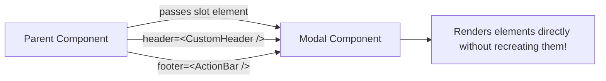

<div className="flex gap-2 mb-4">
  <Badge color="blue" size="sm">API Design</Badge>
  <Badge color="purple" size="sm">Slot Architecture</Badge>
  <Badge color="green" size="sm">Advanced</Badge>
</div>

<Card title="30-Second Senior Interview Pitch" icon="microphone">
  Instead of passing configuration data (like titles, colors, icons) and letting a component make rendering decisions via endless boolean flags, pass React Elements directly via props (the 'Slot Pattern'). This allows consumers full flexibility over how subsections look and behave, while maintaining strict performance isolation: internal state updates inside the host component never cause the injected slot elements to re-render. If the host needs to inject internal state into the slot, render props or Context should be preferred over React.cloneElement.
</Card>

## Under The Hood (Fiber Engine & Architecture)



- Slot Architecture: Passing elements as named props (`<Layout sidebar={<Nav />} main={<Feed />} />`) mirrors native Web Component slots. It keeps the host component focused purely on positioning and state, while leaving rendering details to the consumer.
- Passing Data to Props: If a container needs to pass internal state to an element received as a prop, historically `React.cloneElement(element, { ...newProps })` was used. However, cloneElement makes prop flow invisible, can silently overwrite props, and is discouraged in modern React.
- Modern Alternatives: For passing container state to slots, modern React favors render props (`slot: (state) => <JSX />`) or lightweight contextual composition.
- Conditional Evaluation Trap: Writing `isOpen ? `` : null` in the parent only evaluates `` when open. But passing it as a prop `modal={``}` evaluates the element object even if the child decides not to render it! Beware of eager evaluation for heavy elements.

## Implementation Patterns & Approaches

<CodeGroup>
```tsx Pattern A: Direct Element Slot Zero Coupling
function Card({
  title,
  actionSlot,
}: {
  title: string;
  actionSlot?: React.ReactNode;
}) {
  const [expanded, setExpanded] = useState(false);
  return (
    <div>
      <h3>{title}</h3>
      <button onClick={() => setExpanded(!expanded)}>Toggle</button>
      {actionSlot} {/* Preserves reference across toggle re-renders! */}
    </div>
  );
}
```

```tsx Pattern B: Scoped Slot Render Prop for State
function Card({
  renderAction,
}: {
  renderAction?: (state: { isExpanded: boolean }) => React.ReactNode;
}) {
  const [isExpanded, setExpanded] = useState(false);
  return (
    <div>
      <button onClick={() => setExpanded(!isExpanded)}>Toggle</button>
      {renderAction?.({ isExpanded })}
    </div>
  );
}
```

</CodeGroup>

### Pattern A: Direct Element Slot (Zero Coupling) (Simplest & Cleanest)

Pass complete JSX elements to named prop slots when the slot does not require internal state from the container.

**Advantages & When to Use:**
- Clean, declarative, and type-safe
- Injected element is immune to container re-renders

**Tradeoffs & Watch Out For:**
- Slot cannot read container internal state directly

### Pattern B: Scoped Slot (Render Prop for State) (Interactive Slot)

When the slot must read container state, pass a function returning JSX (scoped slot).

**Advantages & When to Use:**
- Exposes container state to the consumer without context
- Full inversion of control

**Tradeoffs & Watch Out For:**
- Re-executes function when container state changes

## Pitfalls & Anti-Patterns

### ⚠️ Anti-Pattern: Boolean Prop Explosion Instead of Slots

<Warning>
  **Why It Breaks:** The component becomes a bloated monster with hundreds of conditional branches. Every time a new icon, button, or link is needed, engineers must add more boolean props to Header.
</Warning>

<CodeGroup>
```tsx Buggy Code
// ❌ Terrible API: 15 boolean flags and configuration props
<Header
  showSearch={true}
  searchPlaceholder="Search…"
  onSearch={handleSearch}
  showNotifications={true}
  notificationCount={5}
  showUserAvatar={true}
  avatarUrl="/user.png"
  showHelpIcon={false}
  theme="dark"
/>
```

```tsx Senior Solution
// ✅ Beautiful Slot Architecture
<Header
  leftSlot={<SearchBar onSearch={handleSearch} />}
  rightSlot={
    <div className="flex gap-2">
      <NotificationBell count={5} />
      <UserAvatar url="/user.png" />
    </div>
  }
/>
```
</CodeGroup>

<Tip>
  **Senior Explanation:** Slots invert control. Header only manages layout and responsiveness; the consumer decides what components to compose into each slot. The code is modular and extensible.
</Tip>

## Senior Interview Q&A

<AccordionGroup>
  <Accordion title="Q: What is the Slot pattern in React and what are its benefits? (Common Level)">
    The Slot pattern is passing pre-instantiated React elements into specific named props (e.g., `leftSlot`, `actionsSlot`, `footer`) instead of passing raw configuration data. It provides inversion of control, prevents boolean prop explosion, and optimizes performance because the host component re-rendering from internal state will never cause the injected slot elements to re-render.
  </Accordion>
  <Accordion title="Q: Why is React.cloneElement considered an anti-pattern in modern React? (Senior Level)">
    React.cloneElement mutates and overrides props behind the scenes. It creates hidden prop dependencies where child components unexpectedly receive props not declared in their JSX. It also breaks TypeScript type safety, can cause runtime collisions, and interferes with React Compiler optimizations. Modern React prefers composition, render props, or Context instead.
  </Accordion>
</AccordionGroup>

## Complete Playground Component

<CodeGroup>
```tsx 03-elements-as-props-configuration.tsx
import React, { useState } from 'react';
import { RenderCounter } from '../../../components/ui/RenderCounter';
import { Shield, Sparkles, Star } from 'lucide-react';

interface CardProps {
  title: string;
  badgeSlot?: React.ReactNode;
  actionSlot?: React.ReactNode;
}

const ConfigurableCard: React.FC<CardProps> = ({
  title,
  badgeSlot,
  actionSlot,
}) => {
  const [likes, setLikes] = useState(0);

  return (
    <div className="border border-stone-200 dark:border-stone-800 bg-stone-100/50 dark:bg-stone-900/50 p-5 space-y-4">
      <div className="flex items-center justify-between">
        <div className="flex items-center gap-2">
          <h4 className="text-sm font-medium text-stone-900 dark:text-stone-50">
            {title}
          </h4>
          {/* Default value pattern if not passed */}
          {badgeSlot || (
            <span className="text-[10px] font-mono uppercase px-1.5 py-0.5 border border-stone-300 dark:border-stone-700 text-stone-400">
              Default Badge
            </span>
          )}
        </div>
        <RenderCounter name="CardContainer" />
      </div>

      <div className="flex items-center justify-between pt-2 border-t border-stone-200 dark:border-stone-800">
        <button
          onClick={() => setLikes((l) => l + 1)}
          className="px-3 py-1.5 bg-stone-900 dark:bg-stone-50 text-stone-50 dark:text-stone-900 text-xs font-medium flex items-center gap-1.5"
        >
          <Star className="w-3.5 h-3.5 text-[#C8102E]" />
          <span>Like ({likes})</span>
        </button>

        {/* Action slot injected from props */}
        {actionSlot}
      </div>
    </div>
  );
};

// Slot component that demonstrates render isolation
const CustomActionSlot: React.FC<{ label: string }> = ({ label }) => {
  return (
    <div className="flex items-center gap-2">
      <span className="text-xs text-stone-500 font-mono">{label}</span>
      <RenderCounter name="SlotChild" />
    </div>
  );
};

export default function ElementsAsPropsDemo() {
  const [parentCount, setParentCount] = useState(0);

  return (
    <div className="space-y-6">
      <div className="flex items-center justify-between pb-3 border-b border-stone-200 dark:border-stone-800">
        <div>
          <h4 className="text-xs uppercase font-mono tracking-wider text-stone-500">
            Slot Composition & Configuration
          </h4>
          <p className="text-xs text-stone-400 mt-1">
            Clicking "Like" updates Card internal state. Notice how the injected
            Slot child does NOT re-render!
          </p>
        </div>
        <button
          onClick={() => setParentCount((c) => c + 1)}
          className="px-3 py-1 text-xs border border-stone-300 dark:border-stone-700 font-mono text-stone-600 dark:text-stone-300 hover:border-stone-500"
        >
          Re-render Grandparent ({parentCount})
        </button>
      </div>

      <ConfigurableCard
        title="Payment Security Module"
        badgeSlot={
          <span className="text-[10px] font-mono uppercase px-2 py-0.5 border border-emerald-500/30 bg-emerald-500/10 text-emerald-600 dark:text-emerald-400 flex items-center gap-1">
            <Shield className="w-3 h-3" />
            Verified
          </span>
        }
        actionSlot={<CustomActionSlot label="Injected Slot Component" />}
      />

      <ConfigurableCard
        title="Pro Member Plan"
        badgeSlot={
          <span className="text-[10px] font-mono uppercase px-2 py-0.5 border border-[#C8102E]/30 bg-[#C8102E]/10 text-[#C8102E] flex items-center gap-1">
            <Sparkles className="w-3 h-3" />
            Exclusive
          </span>
        }
      />
    </div>
  );
}
```
</CodeGroup>
