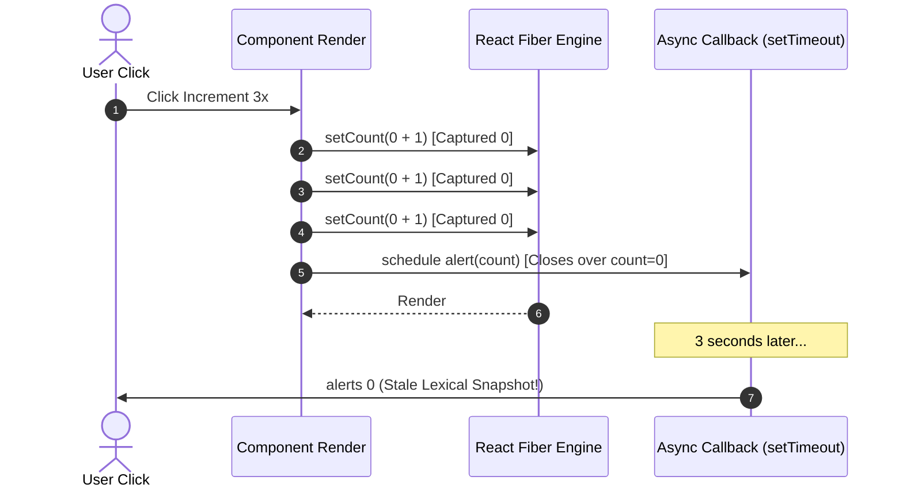

<div className="flex gap-2 mb-4">
  <Badge color="green" size="sm">Mental Model</Badge>
  <Badge color="red" size="sm">Closure Trap</Badge>
  <Badge color="purple" size="sm">High-Yield</Badge>
</div>

<Card title="30-Second Senior Interview Pitch" icon="microphone">
  React state is not a live mutable object on your component instance—it is a static snapshot frozen in time for each specific render. When you call setState, you request a brand-new snapshot for the NEXT render. Any callbacks or event handlers scheduled in the current render forever close over that render’s immutable snapshot values.
</Card>

## Under The Hood (Fiber Engine & Architecture)



- Render Phase: React calls your component function to calculate what the JSX tree should look like. This phase must be pure and free of side effects.
- During render, useState returns a pointer to the memoized state stored in the Fiber node for that hook index.
- Commit Phase: React applies the calculated DOM differences to the actual browser DOM (inserts, updates, deletes).
- After the DOM is updated, React executes layout effects synchronously before paint, and browser paint happens, followed by asynchronous useEffect execution.
- Each render pass has its own closure context containing that specific snapshot of props, state, and event handlers.

## Implementation Patterns & Approaches

<CodeGroup>
```tsx Direct State Replacement
const [count, setCount] = useState(0);

// Good when replacing independently:
function handleReset() {
  setCount(0);
}

function handleInput(e) {
  setText(e.target.value);
}
```

```tsx Functional Updater Pattern
const [count, setCount] = useState(0);

// Safely queues sequential updates:
function handleTripleIncrement() {
  setCount(c => c + 1); // 0 -> 1
  setCount(c => c + 1); // 1 -> 2
  setCount(c => c + 1); // 2 -> 3
  // Final count will be 3!
}
```

```tsx Ref Latest Value Mirror
const [count, setCount] = useState(0);
const countRef = useRef(count);
countRef.current = count;

function handleDelayedLog() {
  setTimeout(() => {
    // Reads current live ref instead of frozen render snapshot!
    console.log('Live current:', countRef.current);
    console.log('Frozen snapshot:', count);
  }, 3000);
}
```

</CodeGroup>

### Direct State Replacement (Standard)

Passing a concrete value to setState when the next value does not depend on a sequence of preceding updates within the same event cycle.

**Advantages & When to Use:**
- Simple, clean, and declarative for 90% of UI form inputs
- Directly reflects the explicit user input without queue overhead

**Tradeoffs & Watch Out For:**
- Prone to race conditions if called multiple times synchronously
- Fails when computing progressive increments in loops or batched steps

### Functional Updater Pattern (Bulletproof)

Passing an updater callback (prev => next) to let React supply the latest queued pending state rather than reading from the current snapshot.

**Advantages & When to Use:**
- Guarantees sequential application of chained state updates
- Does not require including the state variable in useEffect dependency arrays when updating based on previous value

**Tradeoffs & Watch Out For:**
- Slightly more verbose syntax
- The updater function must be pure without side-effects (React may run it twice in Strict Mode)

### Ref Latest Value Mirror (Async Escape Hatch)

Using a mutable ref to hold the newest value synchronously across async timeouts or WebSocket callbacks without waiting for re-renders.

**Advantages & When to Use:**
- Allows long-lived callbacks (event listeners, intervals) to access fresh data without tearing down and recreating subscriptions

**Tradeoffs & Watch Out For:**
- Mutating refs bypasses React rendering lifecycle and does not trigger UI updates on its own

## Pitfalls & Anti-Patterns

### ⚠️ Anti-Pattern: The Sequential Triple-setState Trap

<Warning>
  **Why It Breaks:** Variables declared inside a function component do not mutate. React calls your component function, passing in count = 0 as a constant. Calling setCount(count + 1) three times simply requests "render 1 next" three identical times.
</Warning>

<CodeGroup>
```tsx Buggy Code
function handleClick() {
  // Bug: count is frozen at 0 in this snapshot
  setCount(count + 1); // setCount(0 + 1)
  setCount(count + 1); // setCount(0 + 1)
  setCount(count + 1); // setCount(0 + 1)
  // Result on next render: count is 1, NOT 3!
}
```

```tsx Senior Solution
function handleClick() {
  // Fix: Queue updater functions that receive pending state
  setCount(c => c + 1);
  setCount(c => c + 1);
  setCount(c => c + 1);
  // Result on next render: count is 3!
}
```
</CodeGroup>

<Tip>
  **Senior Explanation:** Functional state updaters (c => c + 1) are queued in the Fiber node updateQueue and evaluated sequentially against the accumulating pending state during the upcoming render phase.
</Tip>

### ⚠️ Anti-Pattern: Expecting State Variable to Mutate Immediately

<Warning>
  **Why It Breaks:** setState is an asynchronous request for a future render pass, not an in-place variable mutation. The current execution frame of handleSearch will always see the initial query string value from the current snapshot.
</Warning>

<CodeGroup>
```tsx Buggy Code
const [query, setQuery] = useState('');

function handleSearch(e) {
  setQuery(e.target.value);
  // BUG: query here is STILL the old value!
  fetchData(query);
}
```

```tsx Senior Solution
function handleSearch(e) {
  const nextQuery = e.target.value;
  setQuery(nextQuery);
  // FIX: Pass the newly calculated variable directly
  fetchData(nextQuery);
}
```
</CodeGroup>

<Tip>
  **Senior Explanation:** Never read the state variable immediately after calling its setter in the same event handler. If subsequent functions need the new value immediately, store it in a local constant and pass that constant directly.
</Tip>

## Senior Interview Q&A

<AccordionGroup>
  <Accordion title="Q: Why does setCount(count + 1) called three times consecutively only increment the counter by 1? (Common Level)">
    Because `count` is a local const variable inside that execution frame of the component function, not a mutable cell. During that render, `count` evaluates to a fixed number (e.g. 0). All three calls evaluate to `setCount(0 + 1)`. When React processes the batched updates at the end of the event handler, it overwrites the state with 1. To queue sequential transformations, you must pass updater functions `setCount(prev => prev + 1)`.
  </Accordion>
  <Accordion title="Q: What is the difference between the Render Phase and the Commit Phase in React? (Senior Level)">
    In the Render Phase, React executes your component functions to construct the virtual Fiber tree and calculate the diff (the "reconciliation"). This phase can be paused, aborted, or restarted concurrently by React. In the Commit Phase, React takes the completed list of mutations and writes them to the actual browser DOM synchronously. Commit cannot be interrupted.
  </Accordion>
  <Accordion title="Q: In a setTimeout callback inside a component, why does console.log(state) show the value from when the timeout was scheduled instead of the current state? (Tricky Level)">
    Because JavaScript closures capture variables from their lexical environment at creation time. The component function ran, state had a specific value in that snapshot, and the setTimeout callback closed over that snapshot variable. Even if subsequent renders have executed since then with new state values, the timer function still references the variables of the execution frame in which it was created. To access live values asynchronously, use a `useRef` or the latest-value ref pattern.
  </Accordion>
</AccordionGroup>

## Complete Playground Component

<CodeGroup>
```tsx 02-state-as-a-snapshot.tsx
import React, { useState } from 'react';
import { RenderCounter } from '../../../components/ui/RenderCounter';
import {
  Camera,
  RefreshCw,
  Send,
  AlertTriangle,
  CheckCircle2,
} from 'lucide-react';

export const StateAsSnapshotDemo: React.FC = () => {
  const [count, setCount] = useState(0);
  const [asyncLog, setAsyncLog] = useState<string[]>([]);
  const [message, setMessage] = useState('');
  const [status, setStatus] = useState<'idle' | 'sending' | 'sent'>('idle');

  // Trap: Triple setState with direct variable
  const handleTripleIncrementTrap = () => {
    // Each setCount call receives the snapshot of count from this render!
    // If count is 0: setCount(0 + 1), setCount(0 + 1), setCount(0 + 1)
    setCount(count + 1);
    setCount(count + 1);
    setCount(count + 1);
  };

  // Fixed: Updater functions
  const handleTripleIncrementUpdater = () => {
    // Each updater receives the pending state from the queue: 0 -> 1 -> 2 -> 3
    setCount((prev) => prev + 1);
    setCount((prev) => prev + 1);
    setCount((prev) => prev + 1);
  };

  // Async Snapshot Trap: State inside setTimeout remembers the render when it was scheduled!
  const handleAsyncSend = () => {
    setStatus('sending');
    const scheduledCount = count;
    const msg = message || 'Hello!';

    setTimeout(() => {
      setStatus('sent');
      setAsyncLog((prev) => [
        ...prev,
        `Sent "${msg}" (Render Snapshot Count: ${scheduledCount}, Current Live Count: ${count} at execution time)`,
      ]);
    }, 2000);
  };

  return (
    <div className="space-y-6">
      {/* Overview Card */}
      <div className="border border-[#d8e2d4] dark:border-[#262b26] bg-white dark:bg-[#161816] rounded-xl p-5 shadow-xs">
        <div className="flex items-center justify-between pb-3 border-b border-[#d8e2d4] dark:border-[#262b26]">
          <div className="flex items-center gap-2">
            <Camera className="w-4 h-4 text-[#19e76e]" />
            <h3 className="text-sm font-semibold text-stone-900 dark:text-stone-100">
              State As A Snapshot: The Render Mental Model
            </h3>
          </div>
          <RenderCounter name="SnapshotParent" />
        </div>
        <p className="text-xs text-stone-600 dark:text-stone-300 mt-2 leading-relaxed">
          Rendering is React taking a snapshot of your UI for a specific pass.
          State variables are not mutable storage cells inside your
          function—they are <strong>fixed constants</strong> scoped to that
          specific render execution.
        </p>
      </div>

      {/* Experiment 1: The Triple Increment Trap */}
      <div className="border border-[#d8e2d4] dark:border-[#262b26] bg-white dark:bg-[#161816] rounded-xl p-5 shadow-xs space-y-4">
        <div className="flex items-center justify-between">
          <div>
            <h4 className="text-xs font-mono uppercase tracking-wider text-[#0a5c2c] dark:text-[#19e76e] font-semibold">
              Experiment 1: Triple setState in One Event
            </h4>
            <p className="text-xs text-stone-500 mt-0.5">
              Current Render Snapshot Count:{' '}
              <strong className="text-stone-900 dark:text-stone-100 font-mono text-sm px-1.5 py-0.5 rounded bg-[#f0f5ee] dark:bg-[#1f241f] border border-[#d8e2d4] dark:border-[#262b26]">
                {count}
              </strong>
            </p>
          </div>
          <button
            onClick={() => setCount(0)}
            className="px-2.5 py-1 text-xs font-mono text-stone-500 hover:text-stone-900 dark:hover:text-stone-100 flex items-center gap-1 border border-[#d8e2d4] dark:border-[#262b26] rounded-lg bg-[#f0f5ee] dark:bg-[#1f241f]"
          >
            <RefreshCw className="w-3 h-3" /> Reset
          </button>
        </div>

        <div className="grid grid-cols-1 sm:grid-cols-2 gap-3">
          {/* Buggy button */}
          <div className="border border-amber-200/80 dark:border-amber-900/40 bg-[#faf7f0] dark:bg-[#201d14] rounded-xl p-4 space-y-3">
            <div className="flex items-center gap-1.5 text-xs text-amber-800 dark:text-amber-300 font-semibold font-mono">
              <AlertTriangle className="w-3.5 h-3.5 text-amber-600" />
              <span>Snapshot Trap: setCount(count + 1) × 3</span>
            </div>
            <p className="text-[11px] text-stone-600 dark:text-stone-300 leading-normal">
              Calls <code>setCount({count} + 1)</code> three times. Because{' '}
              <code>count</code> is constant in this snapshot, it only
              increments by <strong>1</strong>.
            </p>
            <button
              onClick={handleTripleIncrementTrap}
              className="w-full py-2 px-3 text-xs font-mono rounded-lg border border-amber-300 dark:border-amber-700 bg-amber-100 dark:bg-amber-900/40 text-amber-900 dark:text-amber-200 hover:bg-amber-200 dark:hover:bg-amber-900/60 transition-colors font-medium"
            >
              Run: setCount(count + 1) x 3
            </button>
          </div>

          {/* Correct button */}
          <div className="border border-[#19e76e]/40 dark:border-[#19e76e]/20 bg-[#f2fcf5] dark:bg-[#142319] rounded-xl p-4 space-y-3">
            <div className="flex items-center gap-1.5 text-xs text-[#0a5c2c] dark:text-[#19e76e] font-semibold font-mono">
              <CheckCircle2 className="w-3.5 h-3.5 text-[#19e76e]" />
              <span>Solution: setCount(c =&gt; c + 1) × 3</span>
            </div>
            <p className="text-[11px] text-stone-600 dark:text-stone-300 leading-normal">
              Queues 3 updater functions in React’s internal queue. Evaluates
              sequentially:{' '}
              <code>
                {count} &rarr; {count + 1} &rarr; {count + 2} &rarr; {count + 3}
              </code>
              .
            </p>
            <button
              onClick={handleTripleIncrementUpdater}
              className="w-full py-2 px-3 text-xs font-mono rounded-lg border border-[#19e76e]/50 bg-[#19e76e]/20 text-[#0a5c2c] dark:text-[#19e76e] hover:bg-[#19e76e]/30 transition-colors font-semibold"
            >
              Run: setCount(c =&gt; c + 1) x 3
            </button>
          </div>
        </div>
      </div>

      {/* Experiment 2: Async Closure Snapshot */}
      <div className="border border-[#d8e2d4] dark:border-[#262b26] bg-white dark:bg-[#161816] rounded-xl p-5 shadow-xs space-y-4">
        <div>
          <h4 className="text-xs font-mono uppercase tracking-wider text-[#0a5c2c] dark:text-[#19e76e] font-semibold">
            Experiment 2: Asynchronous Closures Remember Their Snapshot
          </h4>
          <p className="text-xs text-stone-500 mt-1">
            Click <strong>Send with 2s Delay</strong>, then immediately
            increment the count above before the 2 seconds finish. Watch what
            value the timeout logs!
          </p>
        </div>

        <div className="flex flex-col sm:flex-row gap-2">
          <input
            type="text"
            value={message}
            onChange={(e) => setMessage(e.target.value)}
            placeholder="Type a message (e.g. 'Hello Interviewer')"
            className="flex-1 px-3 py-2 text-xs rounded-lg border border-[#d8e2d4] dark:border-[#262b26] bg-[#f0f5ee] dark:bg-[#1f241f] text-stone-900 dark:text-stone-100 placeholder:text-stone-400 outline-none focus:border-[#19e76e]"
          />
          <button
            onClick={handleAsyncSend}
            disabled={status === 'sending'}
            className="px-4 py-2 text-xs font-mono rounded-lg border border-[#19e76e]/50 bg-[#19e76e]/20 text-[#0a5c2c] dark:text-[#19e76e] hover:bg-[#19e76e]/30 transition-colors flex items-center justify-center gap-1.5 font-semibold disabled:opacity-50"
          >
            <Send className="w-3.5 h-3.5" />
            {status === 'sending'
              ? 'Sending (2s delay)...'
              : 'Send with 2s Delay'}
          </button>
        </div>

        {asyncLog.length > 0 && (
          <div className="space-y-1 pt-2">
            <span className="text-[11px] font-mono text-stone-400 uppercase tracking-wider block">
              Event Log:
            </span>
            <div className="p-3 bg-[#f0f5ee] dark:bg-[#1f241f] rounded-lg border border-[#d8e2d4] dark:border-[#262b26] font-mono text-xs text-stone-700 dark:text-stone-300 space-y-1">
              {asyncLog.map((log, i) => (
                <div key={i} className="text-[11px] leading-relaxed">
                  &bull; {log}
                </div>
              ))}
            </div>
          </div>
        )}
      </div>
    </div>
  );
};
```
</CodeGroup>
