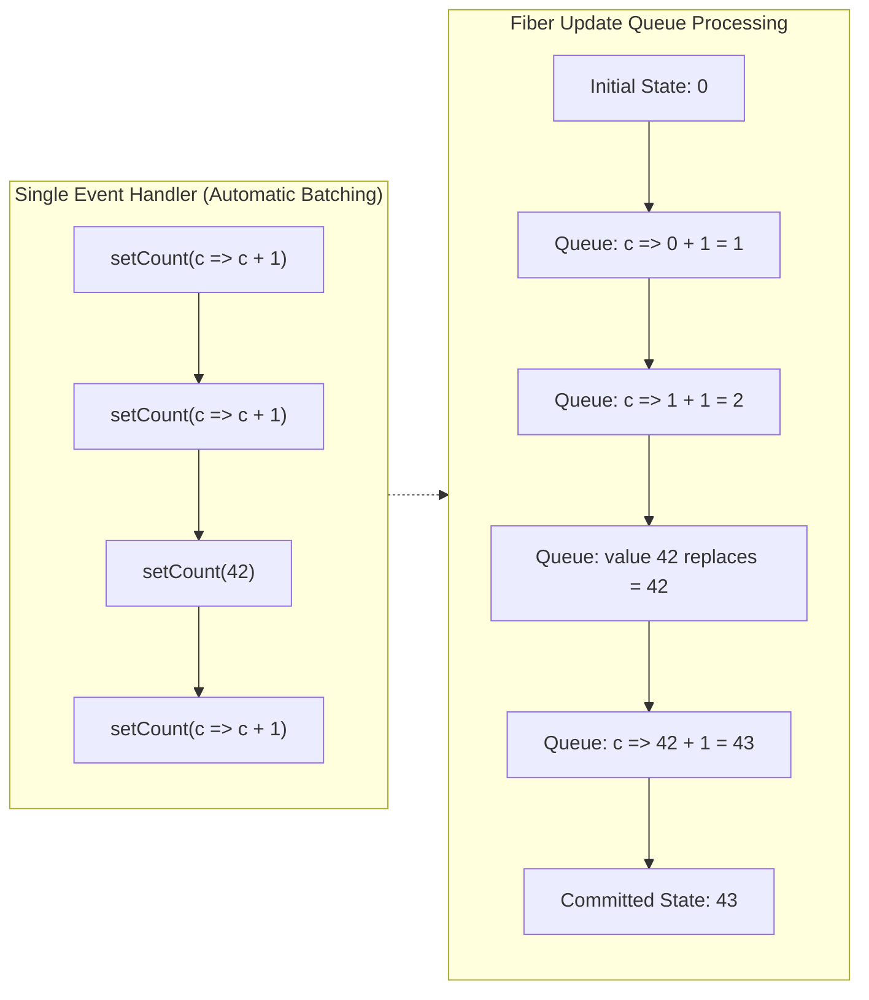

<div className="flex gap-2 mb-4">
  <Badge color="green" size="sm">React 18 & 19 Batching</Badge>
  <Badge color="blue" size="sm">Scheduler Accumulator</Badge>
  <Badge color="purple" size="sm">Staff Level</Badge>
</div>

<Card title="30-Second Senior Interview Pitch" icon="microphone">
  React batches multiple state updates together into a single render pass to prevent half-finished UI states and wasted layout recalculations. Before React 18, batching only applied to React event handlers. In React 18 & 19, automatic batching covers promises, setTimeout, and native event handlers alike. When updater functions are queued, React resolves them sequentially against the pending accumulator.
</Card>

## Under The Hood (Fiber Engine & Architecture)



- Each Fiber node maintains an `updateQueue` linked list containing pending update objects: `{ action, next, lane }`.
- When processing the queue during the render phase, React starts with `baseState`.
- For each update: if `action` is a function, it runs `pendingState = action(pendingState)`. If `action` is a raw value, it assigns `pendingState = action`.
- The final `pendingState` at the end of the queue becomes the new `memoizedState` returned by `useState` on the upcoming render pass.
- React assigns priority "lanes" to updates (e.g., user input is an immediate lane, while transitions use low priority idle lanes).

## Implementation Patterns & Approaches

<CodeGroup>
```tsx Automatic Batching Default
async function handleFetch() {
  const data = await fetchUser();
  // React 18+ groups these 3 into ONE render:
  setUser(data);
  setIsLoading(false);
  setError(null);
}
```

```tsx Updater Accumulator Queue
// Initial: count = 0
setCount(c => c + 1); // pending: 1
setCount(42);         // pending: 42 (overwrites queue)
setCount(c => c + 1); // pending: 42 + 1 = 43
// Next render: count === 43
```

```tsx Opt-Out: flushSync
import { flushSync } from 'react-dom';

function handleAddAndScroll() {
  flushSync(() => {
    setMessages(prev => [...prev, newMsg]);
  });
  // DOM is guaranteed to be updated here:
  listRef.current.scrollTop = listRef.current.scrollHeight;
}
```

</CodeGroup>

### Automatic Batching (Default) (React 18/19 Standard)

All state updates initiated within any JavaScript event loop turn (promises, timeouts, native listeners) are batched into one render cycle automatically.

**Advantages & When to Use:**
- Massive performance win by avoiding layout thrashing
- Zero boilerplate or extra configuration needed
- Guarantees UI consistency during complex data loading

**Tradeoffs & Watch Out For:**
- You cannot immediately read the new DOM state on the very next line of code without flushSync

### Updater Accumulator Queue (Chained State)

Interleaving concrete replacement values with updater functions in React’s internal update queue.

**Advantages & When to Use:**
- Predictable mathematical resolution rules
- Allows composing independent state modifiers without race conditions

**Tradeoffs & Watch Out For:**
- Can confuse developers unfamiliar with queue resolution rules

### Opt-Out: flushSync (Emergency API)

Forces React to synchronously flush pending updates to the browser DOM immediately, useful for third-party canvas or scroll container measurements.

**Advantages & When to Use:**
- Guarantees synchronous DOM updates right when needed

**Tradeoffs & Watch Out For:**
- Hurts performance if overused; breaks concurrent rendering guarantees

## Pitfalls & Anti-Patterns

### ⚠️ Anti-Pattern: Overusing flushSync For Routine Operations

<Warning>
  **Why It Breaks:** flushSync forces synchronous DOM re-layouts on the main thread and halts React’s concurrent prioritization.
</Warning>

<CodeGroup>
```tsx Buggy Code
function handleFormSubmit() {
  // Anti-pattern: Bypassing batching unnecessarily
  flushSync(() => {
    setIsSubmitting(true);
  });
  flushSync(() => {
    setStatus('validating');
  });
}
```

```tsx Senior Solution
function handleFormSubmit() {
  // Good: Let React batch both into a single seamless render
  setIsSubmitting(true);
  setStatus('validating');
}
```
</CodeGroup>

<Tip>
  **Senior Explanation:** flushSync de-optimizes rendering performance by forcing immediate layout flushes. Only use it when code immediately following the update depends synchronously on newly rendered DOM dimensions or scroll positions.
</Tip>

### ⚠️ Anti-Pattern: Assuming Microtasks Break Batching in React 18

<Warning>
  **Why It Breaks:** In React 18/19, Automatic Batching groups updates across microtasks, promises, and timeouts into a single render pass.
</Warning>

<CodeGroup>
```tsx Buggy Code
// Old React 17 workaround thinking:
function handleClick() {
  setLoading(true);
  Promise.resolve().then(() => {
    // Developers in React 17 thought this bypassed batching.
    // In React 18/19, this is STILL batched!
    setCount(1);
    setReady(true);
  });
}
```

```tsx Senior Solution
// Write clean idiomatic React 19 code:
function handleClick() {
  setLoading(true);
  setCount(1);
  setReady(true);
  // All grouped cleanly by React 18/19 automatic batching
}
```
</CodeGroup>

<Tip>
  **Senior Explanation:** React 18 automatic batching operates at the event loop macrotask/microtask boundary. Writing convoluted promise chains to force re-render separation is an anti-pattern.
</Tip>

## Senior Interview Q&A

<AccordionGroup>
  <Accordion title="Q: What was the difference in batching between React 17 and React 18+? (Senior Level)">
    In React 17, batching was limited strictly to React synthetic event handlers (like onClick). Updates triggered inside setTimeout, fetch/Promise callbacks, or native addEventListener calls resulted in multiple separate re-renders. In React 18+, Automatic Batching batches all state updates across promises, timeouts, and native events by default, significantly reducing unnecessary re-renders.
  </Accordion>
  <Accordion title="Q: If state is 0, what does this evaluate to: setCount(c =&gt; c + 1); setCount(42); setCount(c =&gt; c + 1);? (Tricky Level)">
    The final count will be 43. React processes the queue in sequence: 1) Initial count 0 + 1 = 1. 2) The raw value 42 replaces the queued accumulator with 42. 3) The next updater function receives 42 and returns 42 + 1 = 43. The previous increments before 42 are overwritten by the concrete assignment.
  </Accordion>
  <Accordion title="Q: When should you actually use flushSync? (Common Level)">
    You should only use `flushSync` when code immediately following the state update requires the actual browser DOM to already be updated and measured synchronously—for instance, measuring an element’s scrollHeight right after adding a chat message to scroll it into view, or interacting with a non-React imperative canvas library that requires live DOM geometry.
  </Accordion>
</AccordionGroup>

## Complete Playground Component

<CodeGroup>
```tsx 04-queueing-state-updates.tsx
import React, { useState } from 'react';
import { flushSync } from 'react-dom';
import { RenderCounter } from '../../../components/ui/RenderCounter';
import { Layers, Play, Zap, RefreshCw } from 'lucide-react';

export const QueueingStateUpdatesDemo: React.FC = () => {
  const [number, setNumber] = useState(0);
  const [renderCount, setRenderCount] = useState(0);
  const [batchingMode, setBatchingMode] = useState<string>('idle');
  const [executionLog, setExecutionLog] = useState<string[]>([]);

  // Mixed Queue Sequence: Classic interview puzzle!
  // setCount(c => c + 1) -> setCount(42) -> setCount(c => c + 1)
  const handleMixedQueuePuzzle = () => {
    setExecutionLog([
      `Initial State: ${number}`,
      `1. Queued: (c => c + 1) -> pending becomes ${number + 1}`,
      `2. Queued: 42 (replaces queue value completely)`,
      `3. Queued: (c => c + 1) -> pending becomes 42 + 1 = 43`,
    ]);

    setNumber((c) => c + 1);
    setNumber(42);
    setNumber((c) => c + 1);
  };

  // Automatic Batching in React 18+ (even inside setTimeout or fetch)
  const handleAutomaticBatching = () => {
    setBatchingMode('Testing React 18+ Auto Batching inside setTimeout...');
    setTimeout(() => {
      // Both of these updates are grouped into a SINGLE render pass!
      setNumber((n) => n + 10);
      setRenderCount((r) => r + 1);
      setBatchingMode('Completed (1 render pass for both setState calls)');
    }, 500);
  };

  // Opting OUT of batching using flushSync
  const handleFlushSync = () => {
    setBatchingMode(
      'Testing flushSync: Forces immediate synchronous DOM flush'
    );
    // flushSync forces React to flush the first state update to DOM immediately!
    flushSync(() => {
      setNumber((n) => n + 5);
    });
    // This second update is flushed in a separate pass!
    flushSync(() => {
      setRenderCount((r) => r + 1);
    });
    setBatchingMode(
      'flushSync finished: Forced 2 separate synchronous renders'
    );
  };

  const handleReset = () => {
    setNumber(0);
    setRenderCount(0);
    setExecutionLog([]);
    setBatchingMode('idle');
  };

  return (
    <div className="space-y-6">
      {/* Overview Card */}
      <div className="border border-[#d8e2d4] dark:border-[#262b26] bg-white dark:bg-[#161816] rounded-xl p-5 shadow-xs">
        <div className="flex items-center justify-between pb-3 border-b border-[#d8e2d4] dark:border-[#262b26]">
          <div className="flex items-center gap-2">
            <Layers className="w-4 h-4 text-[#19e76e]" />
            <h3 className="text-sm font-semibold text-stone-900 dark:text-stone-100">
              Queueing State Updates &amp; Automatic Batching
            </h3>
          </div>
          <RenderCounter name="BatchingParent" />
        </div>
        <p className="text-xs text-stone-600 dark:text-stone-300 mt-2 leading-relaxed">
          React does not re-render immediately upon calling{' '}
          <code>setState</code>. It collects all state updates inside event
          handlers, promises, and timeouts into an internal queue before
          initiating a single efficient commit.
        </p>
      </div>

      {/* Live State Card */}
      <div className="border border-[#d8e2d4] dark:border-[#262b26] bg-white dark:bg-[#161816] rounded-xl p-5 shadow-xs space-y-4">
        <div className="flex items-center justify-between">
          <div className="flex items-center gap-4">
            <div>
              <span className="text-[10px] font-mono uppercase text-stone-400 block">
                Current Number
              </span>
              <span className="text-2xl font-mono font-semibold text-[#0a5c2c] dark:text-[#19e76e]">
                {number}
              </span>
            </div>
            <div className="h-8 w-[1px] bg-[#d8e2d4] dark:border-[#262b26]" />
            <div>
              <span className="text-[10px] font-mono uppercase text-stone-400 block">
                Triggered Passes
              </span>
              <span className="text-2xl font-mono font-semibold text-stone-800 dark:text-stone-200">
                {renderCount}
              </span>
            </div>
          </div>
          <button
            onClick={handleReset}
            className="px-2.5 py-1 text-xs font-mono text-stone-500 hover:text-stone-900 dark:hover:text-stone-100 flex items-center gap-1 border border-[#d8e2d4] dark:border-[#262b26] rounded-lg bg-[#f0f5ee] dark:bg-[#1f241f]"
          >
            <RefreshCw className="w-3 h-3" /> Reset
          </button>
        </div>

        {/* Experiment 1: The Mixed Queue Sequence */}
        <div className="border border-[#d8e2d4] dark:border-[#262b26] bg-[#f0f5ee] dark:bg-[#1f241f] rounded-xl p-4 space-y-3">
          <div className="flex items-center justify-between">
            <span className="text-xs font-mono uppercase tracking-wider text-stone-700 dark:text-stone-300 font-semibold">
              Interview Puzzle: Mixed Direct &amp; Updater Queue
            </span>
            <span className="text-[10px] font-mono px-2 py-0.5 rounded bg-white dark:bg-[#161816] border border-[#d8e2d4] dark:border-[#262b26]">
              setCount(c =&gt; c+1) &rarr; setCount(42) &rarr; setCount(c =&gt;
              c+1)
            </span>
          </div>
          <p className="text-xs text-stone-600 dark:text-stone-400">
            What will the final number be? Run the test to watch React's queue
            resolution algorithm step-by-step.
          </p>
          <button
            onClick={handleMixedQueuePuzzle}
            className="px-4 py-2 text-xs font-mono rounded-lg border border-[#19e76e]/50 bg-[#19e76e]/20 text-[#0a5c2c] dark:text-[#19e76e] hover:bg-[#19e76e]/30 transition-colors flex items-center gap-2 font-semibold"
          >
            <Play className="w-3.5 h-3.5" /> Run Mixed Queue Test
          </button>

          {executionLog.length > 0 && (
            <div className="p-3 bg-white dark:bg-[#161816] rounded-lg border border-[#d8e2d4] dark:border-[#262b26] space-y-1 font-mono text-xs">
              <span className="text-[10px] text-stone-400 uppercase tracking-wider block font-semibold">
                React Queue Resolution Steps:
              </span>
              {executionLog.map((log, i) => (
                <div key={i} className="text-[#0a5c2c] dark:text-[#19e76e]">
                  {log}
                </div>
              ))}
              <div className="pt-2 text-stone-900 dark:text-stone-100 font-bold border-t border-[#d8e2d4] dark:border-[#262b26]">
                Final Render Result: number = 43
              </div>
            </div>
          )}
        </div>

        {/* Experiment 2: Auto Batching vs flushSync */}
        <div className="grid grid-cols-1 sm:grid-cols-2 gap-3 pt-2">
          <div className="border border-[#d8e2d4] dark:border-[#262b26] bg-white dark:bg-[#161816] rounded-xl p-4 space-y-2">
            <span className="text-xs font-mono uppercase tracking-wider text-[#0a5c2c] dark:text-[#19e76e] font-semibold block">
              React 18+ Auto Batching
            </span>
            <p className="text-[11px] text-stone-600 dark:text-stone-400">
              Updates multiple states inside a <code>setTimeout</code> callback.
              Automatically batched into 1 render.
            </p>
            <button
              onClick={handleAutomaticBatching}
              className="w-full py-2 px-3 text-xs font-mono rounded-lg border border-[#d8e2d4] dark:border-[#262b26] bg-[#f0f5ee] dark:bg-[#1f241f] text-stone-800 dark:text-stone-200 hover:border-[#19e76e] transition-colors"
            >
              Test Async Batching (setTimeout)
            </button>
          </div>

          <div className="border border-[#d8e2d4] dark:border-[#262b26] bg-white dark:bg-[#161816] rounded-xl p-4 space-y-2">
            <div className="flex items-center gap-1.5">
              <Zap className="w-3.5 h-3.5 text-amber-500" />
              <span className="text-xs font-mono uppercase tracking-wider text-amber-700 dark:text-amber-400 font-semibold block">
                Opt-out: flushSync
              </span>
            </div>
            <p className="text-[11px] text-stone-600 dark:text-stone-400">
              Forces immediate synchronous flush to DOM between updates (rarely
              needed, e.g. measuring scroll position).
            </p>
            <button
              onClick={handleFlushSync}
              className="w-full py-2 px-3 text-xs font-mono rounded-lg border border-amber-300 dark:border-amber-800 bg-amber-50 dark:bg-amber-950/30 text-amber-900 dark:text-amber-200 hover:bg-amber-100 transition-colors"
            >
              Force Synchronous flushSync
            </button>
          </div>
        </div>

        {batchingMode !== 'idle' && (
          <div className="p-3 bg-[#f0f5ee] dark:bg-[#1f241f] rounded-lg border border-[#d8e2d4] dark:border-[#262b26] text-xs font-mono text-stone-600 dark:text-stone-300">
            Status: {batchingMode}
          </div>
        )}
      </div>
    </div>
  );
};
```
</CodeGroup>
