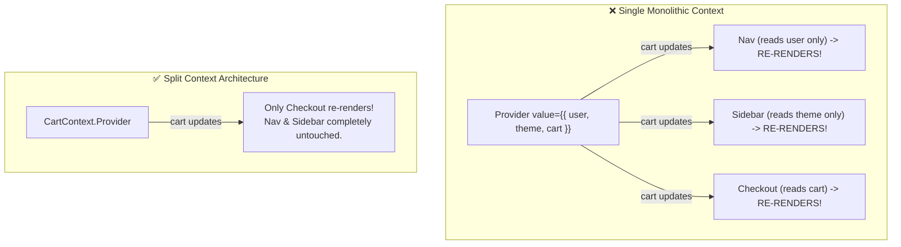

<div className="flex gap-2 mb-4">
  <Badge color="yellow" size="sm">Context Cascade</Badge>
  <Badge color="blue" size="sm">Architecture Pattern</Badge>
  <Badge color="green" size="sm">Selective Re-renders</Badge>
</div>

<Card title="30-Second Senior Interview Pitch" icon="microphone">
  When a Context Provider's `value` prop changes reference, EVERY SINGLE component that calls `useContext(MyContext)` is forced to re-render, bypassing any `React.memo` wrapping on those consumers! The number one performance bug with React Context is storing both changing state and action callbacks in a single monolithic object `&#123; count, increment &#125;`. Even components that only call `increment` (like toolbar buttons) re-render every time `count` updates. The senior solution is **Split Providers**: separate `StateContext` from `DispatchContext`. Because dispatch callbacks are stable, dispatch-only consumers render once and never re-render again.
</Card>

## Under The Hood (Fiber Engine & Architecture)



- Context Consumer Subscription: When a component calls `useContext(Context)`, React registers that Fiber node as a direct listener of the Provider.
- Bypassing Memoization: When the provider `value` changes (determined via `Object.is()`), React marks all subscribed consumers for a re-render. Even if a consumer is wrapped in `React.memo`, React forces it to re-render because context changes take priority over prop memoization.
- Lack of Built-in Selectors: Unlike Redux or Zustand, native React Context lacks selectors. If a context object has 50 fields `{ user, theme, cart, notifications, ... }` and a component only reads `theme`, any update to `cart` will still re-render that component!
- Children-in-Provider Pattern: Always pass `children` into the Provider component rather than declaring children inside the Provider's render body. This ensures the Provider's own state updates do not re-render the children tree via normal parent-child re-render rules.

## Implementation Patterns & Approaches

<CodeGroup>
```tsx Pattern A: Split Providers State vs Dispatch
const CounterStateContext = createContext<number>(0);
const CounterDispatchContext = createContext<() => void>(() => {});

export function CounterProvider({ children }: { children: React.ReactNode }) {
  const [count, setCount] = useState(0);
  const increment = useCallback(() => setCount(c => c + 1), []);

  return (
    <CounterDispatchContext.Provider value={increment}>
      <CounterStateContext.Provider value={count}>
        {children}
      </CounterStateContext.Provider>
    </CounterDispatchContext.Provider>
  );
}

// Consumers only subscribe to what they actually need:
export const useCounter = () => useContext(CounterStateContext);
export const useIncrement = () => useContext(CounterDispatchContext);
```

```tsx Pattern B: Provider with Children Composition
// ✅ Correct: Children are passed in, so their elements are created outside!
function ThemeProvider({ children }: { children: React.ReactNode }) {
  const [theme, setTheme] = useState('dark');
  const value = useMemo(() => ({ theme, setTheme }), [theme]);

  return <ThemeContext.Provider value={value}>{children}</ThemeContext.Provider>;
}
```

</CodeGroup>

### Pattern A: Split Providers (State vs Dispatch) (Senior Architecture Pattern)

Split the context into two separate contexts: one for the volatile data/state, and one for the stable dispatch functions.

**Advantages & When to Use:**
- Dispatch consumers never re-render when state changes
- Simple, native React solution without external libraries
- Clean, decoupled custom hook APIs

**Tradeoffs & Watch Out For:**
- Requires two Provider wrappers instead of one

### Pattern B: Provider with Children Composition (Essential Provider Rule)

Always structure providers to accept and render `{children}` so that the component tree below the provider is not re-rendered by the provider's internal state updates.

**Advantages & When to Use:**
- Unsubscribed children do not re-render when theme changes
- Standard idiom in all production React libraries

**Tradeoffs & Watch Out For:**
- Consumers of ThemeContext still re-render on theme change

## Pitfalls & Anti-Patterns

### ⚠️ Anti-Pattern: Inline Object as Provider Value

<Warning>
  **Why It Breaks:** Whenever UserProvider re-renders for any reason, the inline object `&#123; user, setUser &#125;` generates a new memory address. React sees `oldValue !== newValue` and forces every single context consumer across the entire application to re-render, even if `user` data didn't change at all!
</Warning>

<CodeGroup>
```tsx Buggy Code
function UserProvider({ children }: { children: React.ReactNode }) {
  const [user, setUser] = useState({ name: 'Alice' });

  // ❌ DISASTER: Brand new object reference on EVERY render!
  return (
    <UserContext.Provider value={{ user, setUser }}>
      {children}
    </UserContext.Provider>
  );
}
```

```tsx Senior Solution
function UserProvider({ children }: { children: React.ReactNode }) {
  const [user, setUser] = useState({ name: 'Alice' });

  // ✅ Memoize the value object!
  const value = useMemo(() => ({ user, setUser }), [user]);

  return (
    <UserContext.Provider value={value}>
      {children}
    </UserContext.Provider>
  );
}
```
</CodeGroup>

<Tip>
  **Senior Explanation:** Always wrap the context provider value object in `useMemo` so consumers only re-render when the actual values inside the context change.
</Tip>

## Senior Interview Q&A

<AccordionGroup>
  <Accordion title="Q: Why does React Context cause performance issues in large applications, and how do you solve it? (Senior Level)">
    React Context causes performance issues because it lacks fine-grained selectors. When a Provider's value reference changes, every single component calling `useContext` for that context is forced to re-render, even if it only reads a slice of the object that didn't change, and even if the component is wrapped in `React.memo`. To solve this: 1) Split contexts into separate State and Dispatch contexts, 2) Memoize the Provider value with `useMemo`, and 3) For large shared state, consider `useSyncExternalStore` or selector-based stores like Zustand.
  </Accordion>
  <Accordion title="Q: Does wrapping a Context consumer in React.memo prevent it from re-rendering when the Context value changes? (Common Level)">
    No! `React.memo` only compares props. Context updates bypass `React.memo` entirely. When a context value changes, React traverses directly to the Fiber node that called `useContext` and schedules an immediate re-render.
  </Accordion>
</AccordionGroup>

## Complete Playground Component

<CodeGroup>
```tsx 02-context-and-performance.tsx
import React, { useState, useContext, createContext } from 'react';
import { RenderCounter } from '../../../components/ui/RenderCounter';
import { AlertCircle, CheckCircle } from 'lucide-react';

// -------------------------------------------------------------
// 1. UNOPTIMIZED MONOLITHIC CONTEXT
// -------------------------------------------------------------
interface MonolithicContextType {
  count: number;
  increment: () => void;
}
const MonolithicContext = createContext<MonolithicContextType | null>(null);

const MonolithicDisplay: React.FC = () => {
  const ctx = useContext(MonolithicContext);
  return (
    <div className="border border-stone-200 dark:border-stone-800 p-3 bg-stone-50 dark:bg-stone-950 flex items-center justify-between">
      <span className="text-xs font-mono">Count Display: {ctx?.count}</span>
      <RenderCounter name="CountDisplay" />
    </div>
  );
};

// ⚠️ Only needs dispatch, but re-renders when count changes!
const MonolithicButton: React.FC = () => {
  const ctx = useContext(MonolithicContext);
  return (
    <div className="border border-[#C8102E]/30 bg-[#C8102E]/5 p-3 flex items-center justify-between">
      <div>
        <span className="text-xs font-mono text-[#C8102E] font-medium block">
          Increment Button (Only Needs Dispatch!)
        </span>
        <span className="text-[11px] text-stone-500">
          Re-renders on every count change because context object is shared!
        </span>
      </div>
      <div className="flex items-center gap-2">
        <button
          onClick={ctx?.increment}
          className="px-3 py-1 bg-[#C8102E] text-stone-50 text-xs font-mono"
        >
          +1
        </button>
        <RenderCounter name="ButtonOnlyNeedsDispatch" />
      </div>
    </div>
  );
};

// -------------------------------------------------------------
// 2. OPTIMIZED SPLIT CONTEXT (State vs Dispatch)
// -------------------------------------------------------------
const StateContext = createContext<number>(0);
const DispatchContext = createContext<() => void>(() => {});

const SplitDisplay: React.FC = () => {
  const count = useContext(StateContext);
  return (
    <div className="border border-stone-200 dark:border-stone-800 p-3 bg-stone-50 dark:bg-stone-950 flex items-center justify-between">
      <span className="text-xs font-mono">Count Display: {count}</span>
      <RenderCounter name="SplitCountDisplay" />
    </div>
  );
};

// ✅ Only consumes DispatchContext; NEVER re-renders when count changes!
const SplitButton: React.FC = () => {
  const increment = useContext(DispatchContext);
  return (
    <div className="border border-emerald-500/30 bg-emerald-500/5 p-3 flex items-center justify-between">
      <div>
        <span className="text-xs font-mono text-emerald-700 dark:text-emerald-400 font-medium block">
          Split Button (Consumes ONLY DispatchContext)
        </span>
        <span className="text-[11px] text-stone-500">
          Immune to count updates! Render count stays at 1 forever!
        </span>
      </div>
      <div className="flex items-center gap-2">
        <button
          onClick={increment}
          className="px-3 py-1 bg-emerald-600 text-stone-50 text-xs font-mono"
        >
          +1
        </button>
        <RenderCounter name="DispatchButton" />
      </div>
    </div>
  );
};

export default function ContextPerformanceDemo() {
  const [monolithicCount, setMonolithicCount] = useState(0);
  const [splitCount, setSplitCount] = useState(0);

  // Monolithic increment
  const monolithicIncrement = () => setMonolithicCount((c) => c + 1);

  // Split increment (dispatch is stable)
  const splitIncrement = () => setSplitCount((c) => c + 1);

  return (
    <div className="space-y-8">
      {/* 1. Monolithic Demo */}
      <div className="space-y-3">
        <div className="flex items-center gap-2 text-xs font-mono text-[#C8102E] font-medium pb-2 border-b border-stone-200 dark:border-stone-800">
          <AlertCircle className="w-4 h-4" />
          <span>Case 1: Monolithic Shared Context (Re-render Cascade)</span>
        </div>
        <MonolithicContext.Provider
          value={{ count: monolithicCount, increment: monolithicIncrement }}
        >
          <div className="space-y-3">
            <MonolithicDisplay />
            <MonolithicButton />
          </div>
        </MonolithicContext.Provider>
      </div>

      {/* 2. Split Context Demo */}
      <div className="space-y-3 pt-4 border-t border-stone-200 dark:border-stone-800">
        <div className="flex items-center gap-2 text-xs font-mono text-emerald-600 dark:text-emerald-400 font-medium pb-2 border-b border-stone-200 dark:border-stone-800">
          <CheckCircle className="w-4 h-4" />
          <span>Case 2: Split State & Dispatch Contexts (Senior Pattern)</span>
        </div>
        <DispatchContext.Provider value={splitIncrement}>
          <StateContext.Provider value={splitCount}>
            <div className="space-y-3">
              <SplitDisplay />
              <SplitButton />
            </div>
          </StateContext.Provider>
        </DispatchContext.Provider>
      </div>
    </div>
  );
}
```
</CodeGroup>
