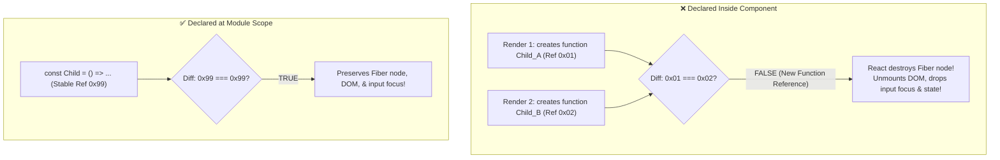

<div className="flex gap-2 mb-4">
  <Badge color="green" size="sm">Fiber Reconciliation</Badge>
  <Badge color="red" size="sm">Fatal Anti-Pattern</Badge>
  <Badge color="blue" size="sm">Component Identity</Badge>
</div>

<Card title="30-Second Senior Interview Pitch" icon="microphone">
  React's reconciliation algorithm uses two primary heuristics to compare virtual trees: Element Type and Key. If the `type` property of an element changes between renders, React considers it a completely different component: it destroys the old Fiber node, unmounts the DOM element, wipes all internal state, cancels active CSS animations, and removes keyboard focus. Declaring a component function INSIDE another component body creates a new function reference on every render, changing its element `type` on every render cycle. This is the notorious 'Mysterious Bug' where text inputs lose focus after every keystroke!
</Card>

## Under The Hood (Fiber Engine & Architecture)



- The Heuristic Check: When diffing a Fiber node against the new React Element, React performs: `if (current.elementType === element.type)`. If true, React updates the existing Fiber node and mutates DOM attributes in-place.
- What happens when type is not equal: If `current.elementType !== element.type`, React executes a full teardown: `deleteRemainingChildren()`. It runs all useEffect cleanups, unmounts the DOM node, creates a brand new Fiber node, and mounts a fresh DOM node.
- Function Equality in JavaScript: In JavaScript, `(() => {}) !== (() => {})`. Every time a parent component function runs, any inner functions declared inside it are instantiated at new memory addresses.
- The Focus Trap: When an input DOM node is removed and replaced by a fresh DOM node with identical visual properties, the browser drops document.activeElement focus because the previously focused node no longer exists in the DOM tree!

## Implementation Patterns & Approaches

<CodeGroup>
```tsx Pattern A: Module Scope Declaration The Rule
// ✅ Declared outside at module level
function ItemInput({ value, onChange }: { value: string; onChange: (v: string) => void }) {
  return <input value={value} onChange={e => onChange(e.target.value)} />;
}

export function Parent() {
  const [text, setText] = useState('');
  return <ItemInput value={text} onChange={setText} />;
}
```

```tsx Pattern B: Simple Render Helper Function Call, NOT JSX Component
export function Parent() {
  const [text, setText] = useState('');

  // ✅ Regular function returning JSX (called as a function, not a component)
  const renderInput = () => {
    return <input value={text} onChange={e => setText(e.target.value)} />;
  };

  return <div>{renderInput()}</div>; // Notice: function invocation, NOT <renderInput />
}
```

</CodeGroup>

### Pattern A: Module Scope Declaration (The Rule) (Mandatory Practice)

Always declare child component functions at the file/module scope outside parent components, passing all required state via props.

**Advantages & When to Use:**
- Stable function reference for the lifetime of the application
- Inputs maintain focus, CSS transitions continue uninterrupted
- Zero accidental unmounts or state resets

**Tradeoffs & Watch Out For:**
- Must pass values via props rather than relying on closure variables

### Pattern B: Simple Render Helper (Function Call, NOT JSX Component) (Alternative for Closures)

If you must access closure variables without writing a separate component, call it as a normal JavaScript function: `{renderInput()}`, NOT `<RenderInput />`.

**Advantages & When to Use:**
- Shares parent closure scope easily
- Element type is simply "input", so React does not unmount it

**Tradeoffs & Watch Out For:**
- Cannot have its own hooks or lifecycle
- Often abused instead of proper component decomposition

## Pitfalls & Anti-Patterns

### ⚠️ Anti-Pattern: Defining a Component Function Inside Another Component

<Warning>
  **Why It Breaks:** Every keystroke triggers ParentForm re-render. A new NameField function is created in memory. React compares `oldElement.type === newElement.type`, which evaluates to false. React destroys the old input DOM element, remounts a new one, and browser keyboard focus is lost after every single character!
</Warning>

<CodeGroup>
```tsx Buggy Code
function ParentForm() {
  const [name, setName] = useState('');

  // ❌ FATAL ANTI-PATTERN: Component declared inside component
  const NameField = () => {
    return (
      <input
        value={name}
        onChange={e => setName(e.target.value)}
        placeholder="Enter your name"
      />
    );
  };

  return (
    <div>
      <NameField /> {/* ❌ Focus lost on every keypress! */}
    </div>
  );
}
```

```tsx Senior Solution
// ✅ Move outside and pass state via props
function NameField({ value, onChange }: { value: string; onChange: (v: string) => void }) {
  return (
    <input
      value={value}
      onChange={e => onChange(e.target.value)}
      placeholder="Enter your name"
    />
  );
}

function ParentForm() {
  const [name, setName] = useState('');
  return <NameField value={name} onChange={setName} />;
}
```
</CodeGroup>

<Tip>
  **Senior Explanation:** Never declare a React component inside another component. Component definitions must have stable references at the module scope so React can reuse existing Fiber nodes across renders.
</Tip>

## Senior Interview Q&A

<AccordionGroup>
  <Accordion title="Q: What is the 'Mysterious Bug' when an input loses focus on every keystroke, and what causes it? (Senior Level)">
    The bug occurs when an engineer declares a component function inside the render body of a parent component and renders it with JSX (`<ChildComponent />`). On every keystroke, the parent re-renders, creating a brand new function reference for the child. During reconciliation, React detects that `element.type` has changed, unmounts the old DOM node, and mounts a fresh one. Because the previously focused DOM element was destroyed, the browser cursor and focus vanish immediately.
  </Accordion>
  <Accordion title="Q: How does React's diffing algorithm handle elements with different types versus the same type? (Common Level)">
    If two elements have different types (e.g. from `<div>` to `<span>`, or from OldComponent to NewComponent), React tears down the entire subtree, executes all cleanup functions, unmounts all associated DOM nodes, and builds a completely new DOM tree from scratch. If two elements have the same type, React keeps the underlying Fiber node and DOM element, only updating the mutated attributes and props in-place.
  </Accordion>
  <Accordion title="Q: What is the difference between rendering renderHelper() vs &lt;RenderHelper /&gt;? (Tricky Level)">
    `{renderHelper()}` is an immediate JavaScript function call in the current component's scope. It returns elements directly into the parent's tree without creating a new Fiber node boundary. `<RenderHelper />` tells React to instantiate a separate component, which creates its own Fiber node, its own hook lifecycle, and evaluates `type` during reconciliation. If declared inside a parent, `<RenderHelper />` unmounts on every render, while `{renderHelper()}` does not.
  </Accordion>
</AccordionGroup>

## Complete Playground Component

<CodeGroup>
```tsx 02-diffing-and-the-mysterious-bug.tsx
import React, { useState } from 'react';
import { RenderCounter } from '../../../components/ui/RenderCounter';
import { AlertCircle, CheckCircle } from 'lucide-react';

// ✅ Correct: Declared OUTSIDE the parent component
const CorrectlyDeclaredInput: React.FC<{
  value: string;
  onChange: (val: string) => void;
  label: string;
}> = ({ value, onChange, label }) => {
  return (
    <div className="space-y-1">
      <div className="flex items-center justify-between">
        <label className="text-xs uppercase font-mono text-stone-500">
          {label}
        </label>
        <RenderCounter name="OutsideInput" />
      </div>
      <input
        type="text"
        value={value}
        onChange={(e) => onChange(e.target.value)}
        placeholder="Type here smoothly…"
        className="w-full border border-stone-300 dark:border-stone-700 bg-stone-50 dark:bg-stone-950 px-3 py-2 text-xs text-stone-900 dark:text-stone-50 outline-none focus:border-emerald-500"
      />
    </div>
  );
};

export default function DiffingAndMysteriousBugDemo() {
  const [correctText, setCorrectText] = useState('');
  const [buggyText, setBuggyText] = useState('');

  // ❌ THE MYSTERIOUS BUG: Declaring a component INSIDE another component!
  // On every keystroke, DiffingAndMysteriousBugDemo re-renders.
  // A brand new function reference is generated for BuggyInputComponent.
  // During diffing, oldElement.type !== newElement.type!
  // React completely unmounts the old DOM node, losing input focus immediately!
  const BuggyInputComponent = () => {
    return (
      <div className="space-y-1">
        <div className="flex items-center justify-between">
          <label className="text-xs uppercase font-mono text-[#C8102E]">
            ❌ Declared Inside Parent (Focus Lost Bug!)
          </label>
          <RenderCounter name="InsideInput" />
        </div>
        <input
          type="text"
          value={buggyText}
          onChange={(e) => setBuggyText(e.target.value)}
          placeholder="Try typing here! Focus lost on EVERY keypress!"
          className="w-full border border-[#C8102E] bg-stone-50 dark:bg-stone-950 px-3 py-2 text-xs text-stone-900 dark:text-stone-50 outline-none"
        />
      </div>
    );
  };

  return (
    <div className="space-y-6">
      <div className="p-4 border border-[#C8102E]/30 bg-[#C8102E]/5 text-xs text-stone-900/80 dark:text-stone-50/80 space-y-2">
        <div className="flex items-center gap-2 font-mono text-[#C8102E] font-medium uppercase">
          <AlertCircle className="w-4 h-4 shrink-0" />
          <span>The Infamous "Mysterious Bug" Investigation</span>
        </div>
        <p className="leading-relaxed">
          Type into both inputs below. In the red input, try typing a word like
          <strong> "React"</strong>. Notice how after{' '}
          <em>every single letter</em>, the cursor disappears and focus is lost!
        </p>
      </div>

      <div className="grid grid-cols-1 md:grid-cols-2 gap-6">
        {/* Buggy Input */}
        <div className="border border-[#C8102E]/30 p-5 space-y-4 bg-stone-100/30 dark:bg-stone-900/30">
          <div className="flex items-center gap-2">
            <span className="w-2 h-2 bg-[#C8102E]" />
            <h4 className="text-xs font-mono uppercase text-[#C8102E] font-medium">
              Declared Inside Parent
            </h4>
          </div>
          {/* Instantiated as JSX */}
          <BuggyInputComponent />
          <p className="text-[11px] text-stone-500 leading-relaxed">
            Every keystroke creates a new function identity. React tears down
            the Fiber node and unmounts the DOM element, wiping the browser
            focus state!
          </p>
        </div>

        {/* Correct Input */}
        <div className="border border-emerald-500/30 p-5 space-y-4 bg-stone-100/30 dark:bg-stone-900/30">
          <div className="flex items-center gap-2">
            <CheckCircle className="w-4 h-4 text-emerald-600 dark:text-emerald-400" />
            <h4 className="text-xs font-mono uppercase text-emerald-700 dark:text-emerald-400 font-medium">
              Declared Outside (Normal)
            </h4>
          </div>
          <CorrectlyDeclaredInput
            value={correctText}
            onChange={setCorrectText}
            label="Correctly Declared Component"
          />
          <p className="text-[11px] text-stone-500 leading-relaxed">
            Component function reference is constant. React reconciles and
            mutates the input value attribute in-place without touching the DOM
            node or focus.
          </p>
        </div>
      </div>
    </div>
  );
}
```
</CodeGroup>
