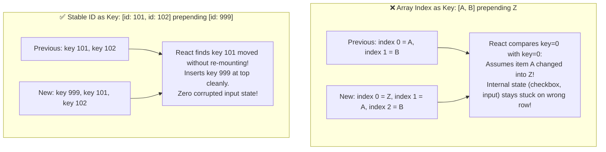

<div className="flex gap-2 mb-4">
  <Badge color="green" size="sm">Key Heuristics</Badge>
  <Badge color="blue" size="sm">State Preservation</Badge>
  <Badge color="purple" size="sm">Critical Senior Concept</Badge>
</div>

<Card title="30-Second Senior Interview Pitch" icon="microphone">
  In React, the `key` prop is not for uniqueness across the whole app; it is the identity token React uses to match Fiber nodes between renders within a list of siblings. When you use array indices (`key=&#123;index&#125;`), inserting, deleting, or reordering items shifts their indices. React matches item at index 0 to previous index 0, mutating props in-place while preserving the old DOM state—resulting in user inputs, checkboxes, and CSS transitions remaining attached to the wrong data items! Conversely, passing a changing key (e.g. `key=&#123;userId&#125;`) to a standalone component is the senior-level 'State Reset' technique that forces React to cleanly unmount and reset state without messy `useEffect` sync logic.
</Card>

## Under The Hood (Fiber Engine & Architecture)



- The Two-Pass Reconciliation: When diffing arrays of elements, React first iterates through both old and new arrays side-by-side. If keys match at the same index, it updates the existing Fiber node in-place.
- Key Map Lookup: If keys do not match, React puts remaining old Fiber children into a Map keyed by their `key`. It then iterates through the new children, performing Map lookups by key to reuse existing Fiber nodes even if their positions moved.
- The Index Shift Disaster: If keys are array indices `[0, 1, 2]` and you prepend an item to the beginning, the new item becomes index 0! React matches new item 0 to old item 0. Any internal uncontrolled DOM state (like typed text, cursor position, selection) stays attached to index 0 instead of moving with its data!
- Why Keys Are Not Needed Outside Arrays: Outside arrays, React uses position in the JSX tree as the implicit key. Keys are only required when an element's position within a dynamic array can shift between renders.

## Implementation Patterns & Approaches

<CodeGroup>
```tsx Pattern A: Stable Unique ID as Key
<ul>
  {items.map(item => (
    <TodoItem key={item.id} item={item} />
  ))}
</ul>
```

```tsx Pattern B: The "State Reset" Technique Key as Component Reset
// ✅ Beautiful: Changing key forces complete clean remount!
function ProfilePage({ userId }: { userId: string }) {
  return <UserProfileForm key={userId} userId={userId} />;
}

// ❌ Anti-pattern: Trying to reset state with useEffect
function UserProfileForm({ userId }: { userId: string }) {
  const [comment, setComment] = useState('');
  useEffect(() => {
    setComment(''); // Flashes stale comment, requires double render!
  }, [userId]);
}
```

</CodeGroup>

### Pattern A: Stable Unique ID as Key (Mandatory for Lists)

Always assign a database ID or crypto-generated UUID as the key for dynamic lists.

**Advantages & When to Use:**
- Items can be sorted, filtered, and prepended safely
- State stays strictly bound to the correct data entity
- Optimal performance: React reorders DOM nodes rather than recreating them

**Tradeoffs & Watch Out For:**
- Data items must provide a persistent unique identifier

### Pattern B: The "State Reset" Technique (Key as Component Reset) (Senior Architecture Pattern)

Give a standalone component a key that changes when the entity changes (e.g. `key={userId}`), telling React to create a fresh Fiber instance.

**Advantages & When to Use:**
- Zero useEffect synchronization boilerplate
- No visual flicker of stale data or double render cycles
- All internal states (inputs, timers, animations) reset cleanly

**Tradeoffs & Watch Out For:**
- Destroys DOM node and recreates it (intended behavior)

## Pitfalls & Anti-Patterns

### ⚠️ Anti-Pattern: Using Random Numbers or Math.random() as Key

<Warning>
  **Why It Breaks:** Generating a new key on every render forces React to destroy and recreate the entire DOM list on every state update. Animations never play, inputs lose focus, and performance drops to 0.
</Warning>

<CodeGroup>
```tsx Buggy Code
<ul>
  {items.map(item => (
    // ❌ DISASTER: New key generated on EVERY render!
    <ListItem key={Math.random()} item={item} />
  ))}
</ul>
```

```tsx Senior Solution
<ul>
  {items.map(item => (
    // ✅ Stable unique ID from data
    <ListItem key={item.id} item={item} />
  ))}
</ul>
```
</CodeGroup>

<Tip>
  **Senior Explanation:** Keys must be stable, predictable, and unique among siblings. Never generate random keys during render.
</Tip>

## Senior Interview Q&A

<AccordionGroup>
  <Accordion title="Q: Why is using array index as key dangerous in React? (Common Level)">
    Using array indices as keys (`key={index}`) causes severe bugs whenever a list is reordered, sorted, prepended, or filtered. Because React identifies items by their index, if an item is inserted at the top, index 0 is assigned to the new item. React assumes old item 0 became new item 0, mutating its props in-place while keeping its existing uncontrolled DOM state (like input values or active checkboxes). This causes user input to stay on the wrong row.
  </Accordion>
  <Accordion title="Q: Can you use the key attribute on normal components outside of arrays? (Senior Level)">
    Yes! This is known as the "State Reset" technique. If you pass a key to a standalone component (e.g. `<UserProfile key={userId} />`), changing the key tells React that the component's identity has changed. React unmounts the previous Fiber instance and mounts a fresh one, completely resetting all internal state without writing redundant, bug-prone `useEffect` reset handlers.
  </Accordion>
</AccordionGroup>

## Complete Playground Component

<CodeGroup>
```tsx 03-reconciliation-and-keys.tsx
import React, { useState } from 'react';
import { RenderCounter } from '../../../components/ui/RenderCounter';
import { AlertTriangle, Plus, RotateCcw } from 'lucide-react';

interface TodoItem {
  id: string;
  label: string;
}

// Uncontrolled input component that holds local DOM state
const TodoRow: React.FC<{ item: TodoItem; onDelete: () => void }> = ({
  item,
  onDelete,
}) => {
  return (
    <div className="flex items-center gap-3 p-3 border border-stone-200 dark:border-stone-800 bg-stone-50 dark:bg-stone-950">
      <span className="text-xs font-mono text-stone-500 w-24 truncate">
        {item.label}:
      </span>
      {/* ⚠️ Uncontrolled input holding DOM state */}
      <input
        type="text"
        placeholder="Type a note in this specific row…"
        className="flex-1 border border-stone-300 dark:border-stone-700 bg-transparent px-2.5 py-1 text-xs text-stone-900 dark:text-stone-50 outline-none focus:border-[#C8102E]"
      />
      <button
        onClick={onDelete}
        className="px-2 py-1 text-xs border border-stone-200 dark:border-stone-800 text-stone-400 hover:text-[#C8102E] hover:border-[#C8102E]"
      >
        ✕
      </button>
      <RenderCounter name={item.label} />
    </div>
  );
};

// Component to demonstrate the State Reset Technique
const UserProfileForm: React.FC<{ userId: string; defaultEmail: string }> = ({
  userId,
  defaultEmail,
}) => {
  // Local state that needs to reset when user changes
  const [draftEmail, setDraftEmail] = useState(defaultEmail);
  const [hasUnsavedChanges, setHasUnsavedChanges] = useState(false);

  return (
    <div className="border border-stone-200 dark:border-stone-800 bg-stone-100/50 dark:bg-stone-900/50 p-4 space-y-3">
      <div className="flex items-center justify-between">
        <span className="text-xs font-mono uppercase text-stone-500">
          User Form (Key = {userId})
        </span>
        <RenderCounter name={`User-${userId}`} />
      </div>
      <div className="flex items-center gap-3">
        <input
          type="text"
          value={draftEmail}
          onChange={(e) => {
            setDraftEmail(e.target.value);
            setHasUnsavedChanges(true);
          }}
          className="border border-stone-300 dark:border-stone-700 bg-stone-50 dark:bg-stone-950 px-3 py-1.5 text-xs text-stone-900 dark:text-stone-50 outline-none flex-1 focus:border-[#C8102E]"
        />
        {hasUnsavedChanges && (
          <span className="text-[10px] font-mono text-[#C8102E] border border-[#C8102E]/40 px-2 py-1">
            Unsaved Draft
          </span>
        )}
      </div>
    </div>
  );
};

export default function ReconciliationAndKeysDemo() {
  const [keyStrategy, setKeyStrategy] = useState<'index' | 'uniqueId'>('index');
  const [todos, setTodos] = useState<TodoItem[]>([
    { id: 'item-1', label: 'Item 01' },
    { id: 'item-2', label: 'Item 02' },
    { id: 'item-3', label: 'Item 03' },
  ]);

  // State Reset Technique Demo State
  const [activeUser, setActiveUser] = useState<'alice' | 'bob'>('alice');

  const prependItem = () => {
    const newId = `item-${Date.now()}`;
    const newLabel = `Item ${todos.length + 1} (New)`;
    setTodos([{ id: newId, label: newLabel }, ...todos]);
  };

  const deleteItem = (idx: number) => {
    setTodos(todos.filter((_, i) => i !== idx));
  };

  return (
    <div className="space-y-8">
      {/* Section 1: The Index Key Corruption Trap */}
      <div className="space-y-4">
        <div className="flex items-center justify-between pb-3 border-b border-stone-200 dark:border-stone-800">
          <div>
            <h4 className="text-xs font-mono uppercase text-stone-500">
              Investigation 1: Index as Key State Corruption
            </h4>
            <p className="text-xs text-stone-400 mt-1">
              1. Type text into the first input ("Item 01"). 2. Click "Prepend
              New Item".
            </p>
          </div>
          <div className="flex items-center gap-2">
            <button
              onClick={() => setKeyStrategy('index')}
              className={`px-2.5 py-1 text-xs font-mono uppercase border ${
                keyStrategy === 'index'
                  ? 'border-[#C8102E] bg-[#C8102E]/10 text-[#C8102E] font-medium'
                  : 'border-stone-200 dark:border-stone-800 text-stone-500'
              }`}
            >
              ❌ key={'{index}'}
            </button>
            <button
              onClick={() => setKeyStrategy('uniqueId')}
              className={`px-2.5 py-1 text-xs font-mono uppercase border ${
                keyStrategy === 'uniqueId'
                  ? 'border-emerald-500 bg-emerald-500/10 text-emerald-700 dark:text-emerald-400 font-medium'
                  : 'border-stone-200 dark:border-stone-800 text-stone-500'
              }`}
            >
              ✅ key={'{item.id}'}
            </button>
          </div>
        </div>

        {keyStrategy === 'index' && (
          <div className="p-3 border border-[#C8102E]/30 bg-[#C8102E]/5 text-xs text-[#C8102E] flex items-center gap-2">
            <AlertTriangle className="w-4 h-4 shrink-0" />
            <span>
              Watch the typed text! With <code>key={'{index}'}</code>,
              prepending causes index 0 to be reused for the new item,
              corrupting your input state!
            </span>
          </div>
        )}

        <div className="flex items-center gap-3">
          <button
            onClick={prependItem}
            className="px-3 py-1.5 bg-[#C8102E] text-stone-50 text-xs font-medium flex items-center gap-1.5"
          >
            <Plus className="w-3.5 h-3.5" />
            <span>Prepend New Item to Top</span>
          </button>
          <span className="text-xs text-stone-400 font-mono">
            Total items: {todos.length}
          </span>
        </div>

        <div className="space-y-2">
          {todos.map((item, index) => (
            <TodoRow
              key={keyStrategy === 'index' ? index : item.id}
              item={item}
              onDelete={() => deleteItem(index)}
            />
          ))}
        </div>
      </div>

      {/* Section 2: The State Reset Technique */}
      <div className="pt-6 border-t border-stone-200 dark:border-stone-800 space-y-4">
        <div>
          <h4 className="text-xs font-mono uppercase text-stone-500">
            Investigation 2: The "State Reset" Technique (Key as Identity)
          </h4>
          <p className="text-xs text-stone-400 mt-1">
            Instead of writing an awkward <code>useEffect</code> to reset
            internal form state when user ID changes, pass{' '}
            <code>key={'{userId}'}</code> to force a clean state reset.
          </p>
        </div>

        <div className="flex items-center gap-3">
          <button
            onClick={() => setActiveUser('alice')}
            className={`px-3 py-1.5 text-xs font-mono uppercase border ${
              activeUser === 'alice'
                ? 'border-[#C8102E] bg-[#C8102E]/10 text-[#C8102E] font-medium'
                : 'border-stone-200 dark:border-stone-800 text-stone-500'
            }`}
          >
            Switch to Alice
          </button>
          <button
            onClick={() => setActiveUser('bob')}
            className={`px-3 py-1.5 text-xs font-mono uppercase border ${
              activeUser === 'bob'
                ? 'border-[#C8102E] bg-[#C8102E]/10 text-[#C8102E] font-medium'
                : 'border-stone-200 dark:border-stone-800 text-stone-500'
            }`}
          >
            Switch to Bob
          </button>
          <span className="text-xs text-stone-400 font-mono flex items-center gap-1">
            <RotateCcw className="w-3.5 h-3.5 text-emerald-500" />
            Key forces fresh instance without useEffect
          </span>
        </div>

        {/* ✅ State reset technique: key changes, React completely remounts fresh instance */}
        <UserProfileForm
          key={activeUser}
          userId={activeUser}
          defaultEmail={
            activeUser === 'alice' ? 'alice@example.com' : 'bob@example.com'
          }
        />
      </div>
    </div>
  );
}
```
</CodeGroup>
