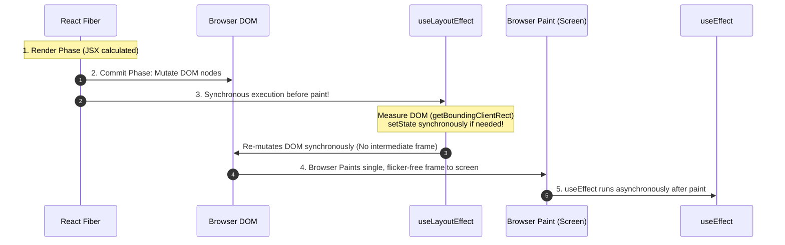

<div className="flex gap-2 mb-4">
  <Badge color="blue" size="sm">DOM Paint Cycle</Badge>
  <Badge color="orange" size="sm">Layout Phase</Badge>
  <Badge color="green" size="sm">Flicker Elimination</Badge>
</div>

<Card title="30-Second Senior Interview Pitch" icon="microphone">
  The crucial difference between `useEffect` and `useLayoutEffect` is their execution timing relative to browser screen paint. `useEffect` is asynchronous and fires AFTER the browser has completed layout and painted pixels onto the screen. If you measure a DOM node (like a tooltip or popover) and update state inside `useEffect`, the user visibly sees the element appear in the wrong spot for 1 frame and jump to its final spot (UI flicker!). In contrast, `useLayoutEffect` fires SYNCHRONOUSLY after DOM mutation but BEFORE browser paint. The browser is paused until the layout effect finishes, ensuring the user only ever sees the final, properly positioned element on frame 1.
</Card>

## Under The Hood (Fiber Engine & Architecture)



- The 4-Step Lifecycle: 1. React Render Phase (evaluates JSX) -> 2. React Commit Phase (mutates real DOM) -> 3. Browser Layout & Recalculate Styles -> 4. Browser Paint (pixels drawn on screen).
- Where useEffect runs: Fires asynchronously after step 4 (after browser paint). This keeps UI responsive and avoids blocking the main thread for data fetching, subscriptions, and timers.
- Where useLayoutEffect runs: Fires synchronously between step 2 and step 3 (after React mutates the DOM, but before the browser paints). Any state update triggered inside useLayoutEffect will be scheduled synchronously before the browser paints the current frame.
- SSR Caveat: In Server-Side Rendering (Next.js, Remix), useLayoutEffect produces a warning because the server has no DOM or layout. In SSR applications, either defer layout measurement to useEffect on the client, or use an isomorphic layout effect fallback.

## Implementation Patterns & Approaches

<CodeGroup>
```tsx Pattern A: useLayoutEffect for Synchronous DOM Measurement
useLayoutEffect(() => {
  const rect = ref.current.getBoundingClientRect();
  // Adjust position synchronously before screen paint!
  setPosition({ top: rect.bottom + 8, left: rect.left });
}, []);
```

```tsx Pattern B: Pure CSS Positioning Modern Fallback
.tooltip {
  position-anchor: --target-button;
  top: anchor(bottom);
  left: anchor(center);
  transform: translateX(-50%);
}
```

</CodeGroup>

### Pattern A: `useLayoutEffect` for Synchronous DOM Measurement (DOM Positioning Standard)

Use when you must read element dimensions (`getBoundingClientRect()`) and adjust coordinates before the user sees the element.

**Advantages & When to Use:**
- Zero visual flickering or coordinate jumping
- Frame-perfect initial render for tooltips, modals, and popovers

**Tradeoffs & Watch Out For:**
- Blocks browser paint until execution completes (keep calculations fast)
- Triggers warning during Server-Side Rendering

### Pattern B: Pure CSS Positioning (Modern Fallback) (Zero JS Execution)

Whenever possible, use modern CSS Anchor Positioning or CSS transforms to position elements without JavaScript measurements.

**Advantages & When to Use:**
- Zero JavaScript execution time
- Works identically on client and server

**Tradeoffs & Watch Out For:**
- Requires modern browser support for CSS Anchor Positioning

## Pitfalls & Anti-Patterns

### ⚠️ Anti-Pattern: Using useLayoutEffect for Data Fetching or Analytics

<Warning>
  **Why It Breaks:** Data fetching and analytics have zero relation to visual DOM layout. Running them in useLayoutEffect blocks the browser from painting the page, delaying First Contentful Paint (FCP) and degrading Lighthouse scores.
</Warning>

<CodeGroup>
```tsx Buggy Code
// ❌ Terrible: Freezes browser paint while setting up fetches!
useLayoutEffect(() => {
  fetch('/api/user-data').then(res => res.json()).then(setData);
  sendPageviewAnalytic();
}, []);
```

```tsx Senior Solution
// ✅ Use standard asynchronous useEffect!
useEffect(() => {
  fetch('/api/user-data').then(res => res.json()).then(setData);
  sendPageviewAnalytic();
}, []);
```
</CodeGroup>

<Tip>
  **Senior Explanation:** 99% of effects belong in useEffect. ONLY use useLayoutEffect when writing code that measures the DOM and immediately alters visual styles/positions to prevent flickering.
</Tip>

## Senior Interview Q&A

<AccordionGroup>
  <Accordion title="Q: What is the exact execution difference between useEffect and useLayoutEffect? (Common Level)">
    `useEffect` runs asynchronously after the browser has calculated layout and painted the screen. `useLayoutEffect` runs synchronously immediately after React mutates the DOM, but BEFORE the browser paints the screen. Therefore, state updates inside `useLayoutEffect` are flushed before the browser renders the frame, preventing visual UI flicker.
  </Accordion>
  <Accordion title="Q: Why does Next.js warn about useLayoutEffect during SSR, and how do you resolve it? (Senior Level)">
    Because `useLayoutEffect` cannot run on the server—there is no DOM or browser layout engine on Node.js. If a component uses `useLayoutEffect` during SSR, the server HTML renders without it, and React warns about hydration mismatch. To fix it, you either use an isomorphic hook that falls back to `useEffect` on the server (`typeof window !== "undefined" ? useLayoutEffect : useEffect`), or delay rendering the dependent UI until the component has mounted on the client.
  </Accordion>
</AccordionGroup>

## Complete Playground Component

<CodeGroup>
```tsx 01-escaping-flicker-with-uselayouteffect.tsx
import { useState, useEffect, useLayoutEffect, useRef } from 'react';
import { RenderCounter } from '../../../components/ui/RenderCounter';
import { Eye } from 'lucide-react';

export default function EscapingFlickerDemo() {
  const [effectType, setEffectType] = useState<'useEffect' | 'useLayoutEffect'>(
    'useEffect'
  );
  const [isOpen, setIsOpen] = useState(false);
  const [tooltipWidth, setTooltipWidth] = useState(0);
  const [positionX, setPositionX] = useState(0);

  const buttonRef = useRef<HTMLButtonElement | null>(null);
  const tooltipRef = useRef<HTMLDivElement | null>(null);

  // Toggle open
  const triggerTooltip = () => {
    // Reset positions to simulate recalculation
    setPositionX(0);
    setIsOpen(true);
  };

  // 1. With useEffect: Runs AFTER browser paint!
  // User sees the tooltip flash at position 0, then jump!
  useEffect(() => {
    if (effectType !== 'useEffect' || !isOpen || !tooltipRef.current) return;

    // Simulate heavy calculation or measurement delay
    const rect = tooltipRef.current.getBoundingClientRect();
    setTooltipWidth(rect.width);
    // Align with button
    if (buttonRef.current) {
      const btnRect = buttonRef.current.getBoundingClientRect();
      setPositionX(btnRect.width + 16);
    }
  }, [isOpen, effectType]);

  // 2. With useLayoutEffect: Runs BEFORE browser paint!
  // Browser paints only after the layout position is calculated! Zero flicker!
  useLayoutEffect(() => {
    if (effectType !== 'useLayoutEffect' || !isOpen || !tooltipRef.current)
      return;

    const rect = tooltipRef.current.getBoundingClientRect();
    setTooltipWidth(rect.width);
    if (buttonRef.current) {
      const btnRect = buttonRef.current.getBoundingClientRect();
      setPositionX(btnRect.width + 16);
    }
  }, [isOpen, effectType]);

  return (
    <div className="space-y-6">
      <div className="flex items-center justify-between pb-3 border-b border-stone-200 dark:border-stone-800">
        <div>
          <h4 className="text-xs font-mono uppercase text-stone-500">
            Escaping Visual UI Flickering
          </h4>
          <p className="text-xs text-stone-400 mt-1">
            Compare <code>useEffect</code> (runs after paint) vs{' '}
            <code>useLayoutEffect</code> (runs before paint).
          </p>
        </div>
        <div className="flex items-center gap-2">
          <button
            onClick={() => {
              setEffectType('useEffect');
              setIsOpen(false);
            }}
            className={`px-3 py-1 text-xs font-mono uppercase border ${
              effectType === 'useEffect'
                ? 'border-[#C8102E] bg-[#C8102E]/10 text-[#C8102E] font-medium'
                : 'border-stone-200 dark:border-stone-800 text-stone-500'
            }`}
          >
            ⚠️ useEffect (Post-Paint)
          </button>
          <button
            onClick={() => {
              setEffectType('useLayoutEffect');
              setIsOpen(false);
            }}
            className={`px-3 py-1 text-xs font-mono uppercase border ${
              effectType === 'useLayoutEffect'
                ? 'border-emerald-500 bg-emerald-500/10 text-emerald-700 dark:text-emerald-400 font-medium'
                : 'border-stone-200 dark:border-stone-800 text-stone-500'
            }`}
          >
            ⚡ useLayoutEffect (Pre-Paint)
          </button>
        </div>
      </div>

      <div className="p-6 border border-stone-200 dark:border-stone-800 bg-stone-100/40 dark:bg-stone-900/40 space-y-6">
        <div className="flex items-center justify-between">
          <button
            ref={buttonRef}
            onClick={triggerTooltip}
            className="px-4 py-2 bg-stone-900 dark:bg-stone-50 text-stone-50 dark:text-stone-900 text-xs font-medium font-mono flex items-center gap-2"
          >
            <Eye className="w-3.5 h-3.5 text-[#C8102E]" />
            <span>Click to Trigger Dynamic Tooltip</span>
          </button>
          <RenderCounter name="TooltipHost" />
        </div>

        {/* Dynamic Tooltip Element */}
        {isOpen && (
          <div className="relative h-16 border border-dashed border-stone-300 dark:border-stone-700 p-2">
            <div
              ref={tooltipRef}
              style={{
                transform: `translateX(${positionX}px)`,
                transition: 'none',
              }}
              className="absolute top-2 left-2 px-3 py-1.5 bg-[#C8102E] text-stone-50 text-xs font-mono whitespace-nowrap shadow-md"
            >
              Dynamic Tooltip (X: {positionX}px, Width:{' '}
              {Math.round(tooltipWidth)}px)
            </div>
          </div>
        )}

        <div className="text-xs text-stone-500 leading-relaxed font-sans border-t border-stone-200 dark:border-stone-800 pt-4">
          {effectType === 'useEffect' ? (
            <p>
              ⚠️ Under <code>useEffect</code>, the tooltip first mounts at X =
              0px, the browser paints it on screen, then <code>useEffect</code>{' '}
              executes and updates state to position it beside the
              button—causing a noticeable jump or flicker!
            </p>
          ) : (
            <p className="text-emerald-700 dark:text-emerald-400">
              ⚡ Under <code>useLayoutEffect</code>, React mutates the DOM, runs
              your measurement synchronously, updates the position state, and
              only THEN allows the browser to paint. The user sees it positioned
              correctly on frame 1!
            </p>
          )}
        </div>
      </div>
    </div>
  );
}
```
</CodeGroup>
