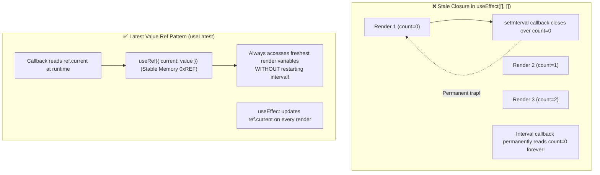

<div className="flex gap-2 mb-4">
  <Badge color="red" size="sm">Stale Closures</Badge>
  <Badge color="blue" size="sm">Latest Value Ref</Badge>
  <Badge color="purple" size="sm">Staff Hook Pattern</Badge>
</div>

<Card title="30-Second Senior Interview Pitch" icon="microphone">
  Every React render has its own snapshot of state, props, and functions captured inside JavaScript lexical closures. If an asynchronous callback (such as setTimeout, setInterval, or an event listener) was created during Render #1 and never re-instantiated, it permanently holds the variables from Render #1—creating the notorious 'Stale Closure' bug. The universal senior escape hatch to access the latest state/props inside an async callback without re-triggering effects is the **Latest Value Ref (`useLatest`) Pattern**: synchronizing the changing value to a mutable `ref.current` on every render.
</Card>

## Under The Hood (Fiber Engine & Architecture)



- Lexical Scope Snapshots: When a function component executes, all const variables, functions, and state are local to that specific render execution.
- The Closure Trap: Functions declared inside a component close over the variables of that specific render. If a callback is passed to `setInterval` or `addEventListener` inside a `useEffect` with an empty dependency array `[]`, that callback will NEVER see any future render's variables!
- Why not just add the variable to the dependency array? Adding `[count]` to `useEffect` fixes the stale closure, but at a huge cost: the timer or event listener is torn down and recreated from scratch on EVERY SINGLE render! For timers, web sockets, or animations, this resets intervals and destroys performance.
- The Ref Escape Hatch: Unlike state and props, a `useRef` object maintains the exact same object reference across all renders. Mutating `ref.current` does not trigger a re-render, and any function that reads `ref.current` at execution time immediately accesses the freshest value regardless of when the closure was formed.

## Implementation Patterns & Approaches

<CodeGroup>
```tsx Pattern A: The useLatest Hook Pattern
// Universal escape hatch for closures
function useLatest<T>(value: T) {
  const ref = useRef(value);
  useEffect(() => {
    ref.current = value;
  });
  return ref;
}

// In your component:
function ChatRoom({ roomId, onMessage }: Props) {
  const latestOnMessage = useLatest(onMessage);

  useEffect(() => {
    const socket = connectSocket(roomId);
    socket.on('message', (msg) => {
      // ✅ Always calls the freshest onMessage without restarting the socket!
      latestOnMessage.current(msg);
    });
    return () => socket.disconnect();
  }, [roomId]); // onMessage is intentionally omitted from deps!
}
```

```tsx Pattern B: Functional State Updates
useEffect(() => {
  const id = setInterval(() => {
    // ✅ Functional update reads latest state without closure capture!
    setCount(prev => prev + 1);
  }, 1000);
  return () => clearInterval(id);
}, []);
```

</CodeGroup>

### Pattern A: The `useLatest` Hook Pattern (Senior Production Pattern)

Encapsulate the ref synchronization into a tiny reusable `useLatest` custom hook.

**Advantages & When to Use:**
- Keeps long-lived connections (WebSockets, intervals) alive without tearing them down
- Always accesses freshest callbacks and props
- Zero stale closure bugs

**Tradeoffs & Watch Out For:**
- Requires mental discipline to read from .current

### Pattern B: Functional State Updates (For State Increments)

When the only reason for stale state is updating a counter or toggle, pass an updater function `setState(prev => prev + 1)`.

**Advantages & When to Use:**
- Cleanest solution when updating own state
- Zero ref boilerplate

**Tradeoffs & Watch Out For:**
- Only works for setting state; does not help when you need to read props or external callbacks

## Pitfalls & Anti-Patterns

### ⚠️ Anti-Pattern: Disabling ESLint Exhaustive-Deps to Avoid Re-running Effects

<Warning>
  **Why It Breaks:** If the user logs out or switches accounts, `user.id` changed in the parent, but the interval continues running with the old user's ID indefinitely because it was closed over in render 1!
</Warning>

<CodeGroup>
```tsx Buggy Code
useEffect(() => {
  const id = setInterval(() => {
    console.log('Sending analytic with user ID:', user.id);
  }, 5000);
  return () => clearInterval(id);
  // ❌ FATAL MISTAKE: Disabling linter hides stale closure!
  // eslint-disable-next-line react-hooks/exhaustive-deps
}, []);
```

```tsx Senior Solution
const latestUser = useLatest(user);

useEffect(() => {
  const id = setInterval(() => {
    // ✅ Always reads current active user
    console.log('Sending analytic with user ID:', latestUser.current.id);
  }, 5000);
  return () => clearInterval(id);
}, []); // Safe because latestUser is a stable ref!
```
</CodeGroup>

<Tip>
  **Senior Explanation:** Never silence exhaustive-deps just to stop an effect from running. Use the Latest Value Ref pattern or redesign the effect.
</Tip>

## Senior Interview Q&A

<AccordionGroup>
  <Accordion title="Q: What is a stale closure in React and how does it happen? (Common Level)">
    A stale closure occurs when an asynchronous callback (such as in `setTimeout`, `setInterval`, `addEventListener`, or a promise) captures variables from a specific render's scope, and because the callback is not recreated on subsequent renders (often due to an empty dependency array `[]`), it continues reading outdated, stale variable values from that past render indefinitely.
  </Accordion>
  <Accordion title="Q: How do you solve a stale closure in useEffect without causing the effect to re-run on every render? (Senior Level)">
    By using the "Latest Value Ref" (`useLatest`) pattern. Store the changing callback or state variable in a `useRef`, and update `ref.current = value` in a render or effect. Inside the asynchronous callback, read `ref.current` instead of the raw variable. Because refs maintain stable object identity while holding mutable values, the callback reads the freshest data without needing the variable in the effect's dependency array.
  </Accordion>
</AccordionGroup>

## Complete Playground Component

<CodeGroup>
```tsx 03-closures-in-react-and-stale-closures.tsx
import { useState, useEffect, useRef } from 'react';
import { RenderCounter } from '../../../components/ui/RenderCounter';
import { AlertCircle, CheckCircle, Play, Pause } from 'lucide-react';

export default function ClosuresAndStaleClosuresDemo() {
  const [count, setCount] = useState(0);

  // -------------------------------------------------------------
  // Case 1: Stale Closure in setInterval
  // -------------------------------------------------------------
  const [staleTimerValue, setStaleTimerValue] = useState(0);
  const [isStaleRunning, setIsStaleRunning] = useState(false);

  useEffect(() => {
    if (!isStaleRunning) return;

    // ❌ Captures `count` from the initial render closure!
    const id = setInterval(() => {
      // Because count is closed over from the first render, it always sees count = initial
      setStaleTimerValue(count);
    }, 1000);

    return () => clearInterval(id);
  }, [isStaleRunning]); // Notice: `count` is omitted from deps! Stale closure!

  // -------------------------------------------------------------
  // Case 2: Escaping with "Latest Value Ref" (useLatest pattern)
  // -------------------------------------------------------------
  const [latestTimerValue, setLatestTimerValue] = useState(0);
  const [isLatestRunning, setIsLatestRunning] = useState(false);

  // Store the latest count in a mutable ref
  const latestCountRef = useRef(count);
  useEffect(() => {
    latestCountRef.current = count;
  });

  useEffect(() => {
    if (!isLatestRunning) return;

    // ✅ Accesses current value via ref without needing count in deps!
    const id = setInterval(() => {
      setLatestTimerValue(latestCountRef.current);
    }, 1000);

    return () => clearInterval(id);
  }, [isLatestRunning]);

  return (
    <div className="space-y-6">
      {/* State controller */}
      <div className="flex items-center justify-between p-4 border border-stone-200 dark:border-stone-800 bg-stone-100/50 dark:bg-stone-900/50">
        <div>
          <span className="text-xs uppercase font-mono text-stone-500 block">
            Parent State
          </span>
          <span className="text-sm font-medium text-stone-900 dark:text-stone-50">
            Active Count Value:{' '}
            <strong className="text-[#C8102E] font-mono text-base">
              {count}
            </strong>
          </span>
        </div>
        <div className="flex items-center gap-2">
          <button
            onClick={() => setCount((c) => c + 1)}
            className="px-3 py-1.5 bg-[#C8102E] text-stone-50 text-xs font-mono font-medium"
          >
            Increment Count (+1)
          </button>
          <RenderCounter name="ParentState" />
        </div>
      </div>

      <div className="grid grid-cols-1 md:grid-cols-2 gap-6">
        {/* Buggy Stale Closure Box */}
        <div className="border border-[#C8102E]/30 bg-[#C8102E]/5 p-5 space-y-4">
          <div className="flex items-center gap-2">
            <AlertCircle className="w-4 h-4 text-[#C8102E]" />
            <h4 className="text-xs font-mono uppercase text-[#C8102E] font-medium">
              1. The Stale Closure Trap
            </h4>
          </div>
          <p className="text-xs text-stone-600 dark:text-stone-400 leading-relaxed">
            Timer runs every second, reading <code>count</code>. But because
            <code>[count]</code> is omitted from dependencies, it remains
            trapped in the closure of when the timer was launched!
          </p>

          <div className="p-3 bg-stone-50 dark:bg-stone-950 border border-stone-200 dark:border-stone-800 flex items-center justify-between">
            <span className="text-xs font-mono">
              Timer Reads Count As:{' '}
              <strong className="text-[#C8102E] text-sm">
                {staleTimerValue}
              </strong>
            </span>
            <button
              onClick={() => setIsStaleRunning(!isStaleRunning)}
              className="px-2.5 py-1 text-xs font-mono border border-stone-300 dark:border-stone-700 flex items-center gap-1"
            >
              {isStaleRunning ? (
                <>
                  <Pause className="w-3 h-3" /> Stop
                </>
              ) : (
                <>
                  <Play className="w-3 h-3 text-[#C8102E]" /> Start Trap
                </>
              )}
            </button>
          </div>
        </div>

        {/* Fixed Solution: Latest Value Ref */}
        <div className="border border-emerald-500/30 bg-emerald-500/5 p-5 space-y-4">
          <div className="flex items-center gap-2">
            <CheckCircle className="w-4 h-4 text-emerald-600 dark:text-emerald-400" />
            <h4 className="text-xs font-mono uppercase text-emerald-700 dark:text-emerald-400 font-medium">
              2. Fixed via "Latest Value Ref" (useLatest)
            </h4>
          </div>
          <p className="text-xs text-stone-600 dark:text-stone-400 leading-relaxed">
            By storing <code>count</code> in a mutable <code>ref.current</code>,
            the interval timer reads the freshest state without recreating the
            timer on every increment!
          </p>

          <div className="p-3 bg-stone-50 dark:bg-stone-950 border border-stone-200 dark:border-stone-800 flex items-center justify-between">
            <span className="text-xs font-mono">
              Timer Reads Count As:{' '}
              <strong className="text-emerald-600 dark:text-emerald-400 text-sm">
                {latestTimerValue}
              </strong>
            </span>
            <button
              onClick={() => setIsLatestRunning(!isLatestRunning)}
              className="px-2.5 py-1 text-xs font-mono border border-stone-300 dark:border-stone-700 flex items-center gap-1"
            >
              {isLatestRunning ? (
                <>
                  <Pause className="w-3 h-3" /> Stop
                </>
              ) : (
                <>
                  <Play className="w-3 h-3 text-emerald-600" /> Start Fixed
                </>
              )}
            </button>
          </div>
        </div>
      </div>
    </div>
  );
}
```
</CodeGroup>
