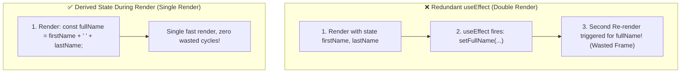

<div className="flex gap-2 mb-4">
  <Badge color="green" size="sm">react.dev Golden Rule</Badge>
  <Badge color="blue" size="sm">Render-Time Derivation</Badge>
  <Badge color="red" size="sm">Avoid Cascading Renders</Badge>
</div>

<Card title="30-Second Senior Interview Pitch" icon="microphone">
  Effects are meant to synchronize React with external systems (APIs, WebSockets, non-React DOM widgets). If you are using useEffect to calculate derived data, update state based on other state, or reset form inputs on prop changes, you are introducing duplicate renders, stale intermediate UI states, and cascading bugs. Instead: compute inline during render, or use keys to reset state.
</Card>

## Under The Hood (Fiber Engine & Architecture)



- External System Synchronization: Connecting to WebSockets, subscribing to window resize/scroll events, or initializing third-party non-React libraries (e.g., Mapbox, Chart.js).
- Data Fetching: Loading data from an API on mount (or preferably using React 19 Actions / Suspense `use()`).
- Sending Analytics / Telemetry: Logging impression beacons when a component appears on screen.
- Controlling non-React widgets: Calling imperative DOM methods like `dialog.showModal()` or `audio.play()` based on prop changes.

## Implementation Patterns & Approaches

<CodeGroup>
```tsx Inline Render Calculation
function Form({ firstName, lastName }) {
  // 0 state, 0 effects, always fresh, 1 render pass:
  const fullName = `${firstName} ${lastName}`.trim();
  return <h1>{fullName}</h1>;
}
```

```tsx Reset State with a Key Prop
export default function ProfilePage({ userId }) {
  // When userId changes, CommentBox remounts fresh!
  // No useEffect needed inside CommentBox to wipe the draft.
  return <CommentBox key={userId} userId={userId} />;
}
```

```tsx Direct Event Handler Logic
function BuyButton({ productId }) {
  // DO NOT: setSubmitted(true) -> useEffect -> post('/buy')
  // DO:
  async function handleBuy() {
    await post(`/api/buy/${productId}`);
    showNotification('Purchased successfully!');
  }
  return <button onClick={handleBuy}>Buy Now</button>;
}
```

</CodeGroup>

### Inline Render Calculation (Gold Standard)

Transforming props or state directly inside the component body during the render phase without allocating extra state or effects.

**Advantages & When to Use:**
- Single render pass with zero delay or intermediate flickers
- Cannot get out of sync with props
- Zero boilerplate and zero memory overhead

**Tradeoffs & Watch Out For:**
- If calculation is extremely expensive (> 1000 items), consider useMemo

### Reset State with a Key Prop (Idiomatic React)

Passing an ID as the key prop to force React to unmount the old component and mount a fresh instance with pristine initial state.

**Advantages & When to Use:**
- Completely declarative and foolproof
- Cleans up all internal state, timers, and animations automatically

**Tradeoffs & Watch Out For:**
- Destroys the DOM subtree and creates a new one (appropriate for distinct items like users/articles)

### Direct Event Handler Logic (Action Driven)

Placing user-initiated mutations directly in event handlers rather than setting flags in state to trigger an effect.

**Advantages & When to Use:**
- Clear cause-and-effect relationship
- Accesses exact arguments and event details at invocation time

**Tradeoffs & Watch Out For:**
- None; this is the intended way to handle user events in React

## Pitfalls & Anti-Patterns

### ⚠️ Anti-Pattern: The Derived State useEffect Cascade

<Warning>
  **Why It Breaks:** React renders UserProfile with stale fullName, commits to the DOM, then runs the effect, which calls setFullName, triggering an immediate second render pass.
</Warning>

<CodeGroup>
```tsx Buggy Code
function UserProfile({ firstName, lastName }) {
  const [fullName, setFullName] = useState('');

  // ANTI-PATTERN: Redundant state + extra render!
  useEffect(() => {
    setFullName(firstName + ' ' + lastName);
  }, [firstName, lastName]);

  return <div>{fullName}</div>;
}
```

```tsx Senior Solution
function UserProfile({ firstName, lastName }) {
  // FIX: Just calculate it during render!
  const fullName = firstName + ' ' + lastName;

  return <div>{fullName}</div>;
}
```
</CodeGroup>

<Tip>
  **Senior Explanation:** Calculating derived values inline during the render phase runs in a single pass with zero lag, eliminates memory overhead, and guarantees the UI never falls out of sync.
</Tip>

### ⚠️ Anti-Pattern: Resetting Internal State in useEffect on Prop Change

<Warning>
  **Why It Breaks:** When userId changes, CommentBox renders with the previous user’s comment visible in the DOM for one frame before the effect runs and clears it.
</Warning>

<CodeGroup>
```tsx Buggy Code
function CommentBox({ userId }) {
  const [comment, setComment] = useState('');

  // ANTI-PATTERN: Stale comment flashes before effect clears it
  useEffect(() => {
    setComment('');
  }, [userId]);

  return <textarea value={comment} onChange={e => setComment(e.target.value)} />;
}
```

```tsx Senior Solution
// FIX: Pass key={userId} at the call site!
<CommentBox key={userId} userId={userId} />

function CommentBox({ userId }) {
  const [comment, setComment] = useState('');
  return <textarea value={comment} onChange={e => setComment(e.target.value)} />;
}
```
</CodeGroup>

<Tip>
  **Senior Explanation:** Passing a key tells React to treat different IDs as distinct components, unmounting and remounting them with clean state automatically without any effects.
</Tip>

## Senior Interview Q&A

<AccordionGroup>
  <Accordion title="Q: Why does the React documentation state that you should almost never use useEffect for derived state? (Common Level)">
    Because storing derived values in state and updating them via useEffect introduces an unnecessary second render pass. The component first renders with stale state, paints to the screen, executes the effect, sets new state, and re-renders again. Calculating derived state inline during render is computed instantly in the exact same render pass with zero overhead and cannot get out of sync.
  </Accordion>
  <Accordion title="Q: How should you reset a form component’s state when a selected item prop (e.g. userId) changes? (Tricky Level)">
    Instead of listening to prop changes in a useEffect and manually resetting every state setter, you should give the component a unique `key` prop tied to the ID (e.g. `<CommentForm key={userId} />`). When the key changes, React unmounts the previous instance and mounts a fresh instance with its default initial state, guaranteeing complete cleanup without extra render passes or stale visual flashes.
  </Accordion>
  <Accordion title="Q: What is the difference between logic that belongs in an event handler vs logic that belongs in useEffect? (Senior Level)">
    Code belongs in an event handler if it runs in direct response to a specific user action (e.g. clicking "Submit", buying an item, deleting a row). Code belongs in `useEffect` only if it needs to run because the component was displayed to the user or because the component needs to synchronize its state with an external system regardless of which specific action brought it there.
  </Accordion>
</AccordionGroup>

## Complete Playground Component

<CodeGroup>
```tsx 03-you-might-not-need-an-effect.tsx
import React, { useState } from 'react';
import { RenderCounter } from '../../../components/ui/RenderCounter';
import { Sparkles, XCircle, CheckCircle2, User, KeyRound } from 'lucide-react';

export const YouMightNotNeedAnEffectDemo: React.FC = () => {
  // Scenario 1: Derived State (Full Name)
  const [firstName, setFirstName] = useState('Dan');
  const [lastName, setLastName] = useState('Abramov');

  // Pure inline calculation (Ideal solution - 0 extra renders!)
  const pureFullName = `${firstName} ${lastName}`.trim();

  // Scenario 2: Resetting component state with Key vs useEffect
  const [selectedUserId, setSelectedUserId] = useState<number>(101);

  return (
    <div className="space-y-6">
      {/* Overview Card */}
      <div className="border border-[#d8e2d4] dark:border-[#262b26] bg-white dark:bg-[#161816] rounded-xl p-5 shadow-xs">
        <div className="flex items-center justify-between pb-3 border-b border-[#d8e2d4] dark:border-[#262b26]">
          <div className="flex items-center gap-2">
            <Sparkles className="w-4 h-4 text-[#19e76e]" />
            <h3 className="text-sm font-semibold text-stone-900 dark:text-stone-100">
              "You Might Not Need an Effect" (react.dev Guide)
            </h3>
          </div>
          <RenderCounter name="EffectAuditParent" />
        </div>
        <p className="text-xs text-stone-600 dark:text-stone-300 mt-2 leading-relaxed">
          Effects are an escape hatch from the React paradigm to synchronize
          with external non-React systems (APIs, DOM events, WebSockets). If
          there is no external system involved, using <code>useEffect</code>{' '}
          creates duplicate renders, stale frames, and cascading bugs.
        </p>
      </div>

      {/* Scenario 1: Derived State vs useEffect */}
      <div className="border border-[#d8e2d4] dark:border-[#262b26] bg-white dark:bg-[#161816] rounded-xl p-5 shadow-xs space-y-4">
        <div>
          <h4 className="text-xs font-mono uppercase tracking-wider text-[#0a5c2c] dark:text-[#19e76e] font-semibold">
            Scenario 1: Derived State (First + Last Name)
          </h4>
          <p className="text-xs text-stone-500 mt-0.5">
            Type into either input and observe how the pure calculation updates
            instantly with ZERO extra renders.
          </p>
        </div>

        <div className="grid grid-cols-1 sm:grid-cols-2 gap-3">
          <input
            type="text"
            value={firstName}
            onChange={(e) => setFirstName(e.target.value)}
            placeholder="First Name"
            className="px-3 py-2 text-xs rounded-lg border border-[#d8e2d4] dark:border-[#262b26] bg-[#f0f5ee] dark:bg-[#1f241f] text-stone-900 dark:text-stone-100 outline-none focus:border-[#19e76e]"
          />
          <input
            type="text"
            value={lastName}
            onChange={(e) => setLastName(e.target.value)}
            placeholder="Last Name"
            className="px-3 py-2 text-xs rounded-lg border border-[#d8e2d4] dark:border-[#262b26] bg-[#f0f5ee] dark:bg-[#1f241f] text-stone-900 dark:text-stone-100 outline-none focus:border-[#19e76e]"
          />
        </div>

        <div className="grid grid-cols-1 sm:grid-cols-2 gap-3 pt-2">
          {/* Anti-Pattern */}
          <div className="border border-amber-200/80 dark:border-amber-900/40 bg-[#faf7f0] dark:bg-[#201d14] rounded-xl p-4 space-y-2">
            <div className="flex items-center gap-1.5 text-xs text-amber-800 dark:text-amber-300 font-semibold font-mono">
              <XCircle className="w-3.5 h-3.5 text-amber-600" />
              <span>Anti-Pattern: useEffect + setState</span>
            </div>
            <p className="text-[11px] text-stone-600 dark:text-stone-400">
              Stores <code>fullName</code> in state and syncs with an effect.
            </p>
            <div className="p-2.5 bg-white dark:bg-[#161816] rounded-lg border border-amber-200 dark:border-amber-900/60 font-mono text-xs text-stone-800 dark:text-stone-200 space-y-1">
              <div>// Renders twice: Pass 1 old, Pass 2 updated</div>
              <div className="text-amber-700 dark:text-amber-400 font-bold">
                Two render passes per keystroke!
              </div>
            </div>
          </div>

          {/* Correct Pattern */}
          <div className="border border-[#19e76e]/40 dark:border-[#19e76e]/20 bg-[#f2fcf5] dark:bg-[#142319] rounded-xl p-4 space-y-2">
            <div className="flex items-center gap-1.5 text-xs text-[#0a5c2c] dark:text-[#19e76e] font-semibold font-mono">
              <CheckCircle2 className="w-3.5 h-3.5 text-[#19e76e]" />
              <span>Official Best Practice: Compute in Render</span>
            </div>
            <p className="text-[11px] text-stone-600 dark:text-stone-400">
              <code>const fullName = firstName + ' ' + lastName;</code>
            </p>
            <div className="p-2.5 bg-white dark:bg-[#161816] rounded-lg border border-[#19e76e]/30 font-mono text-xs text-stone-800 dark:text-stone-200 space-y-1">
              <div>
                Output: <strong>{pureFullName || '(Empty)'}</strong>
              </div>
              <div className="text-[#0a5c2c] dark:text-[#19e76e] font-bold">
                1 single render pass, 0 state variables
              </div>
            </div>
          </div>
        </div>
      </div>

      {/* Scenario 2: Resetting State with Key */}
      <div className="border border-[#d8e2d4] dark:border-[#262b26] bg-white dark:bg-[#161816] rounded-xl p-5 shadow-xs space-y-4">
        <div className="flex items-center justify-between">
          <div>
            <h4 className="text-xs font-mono uppercase tracking-wider text-[#0a5c2c] dark:text-[#19e76e] font-semibold">
              Scenario 2: Resetting Form State When Profile Changes
            </h4>
            <p className="text-xs text-stone-500 mt-0.5">
              Instead of resetting comment drafts via{' '}
              <code>useEffect(() =&gt; setText(''), [userId])</code>, pass a
              dynamic <code>key</code>!
            </p>
          </div>
          <div className="flex items-center gap-2">
            <button
              onClick={() => setSelectedUserId(101)}
              className={`px-2.5 py-1 text-xs font-mono rounded-lg border transition-colors ${
                selectedUserId === 101
                  ? 'border-[#19e76e]/50 bg-[#19e76e]/20 text-[#0a5c2c] dark:text-[#19e76e] font-bold'
                  : 'border-[#d8e2d4] dark:border-[#262b26] text-stone-600 dark:text-stone-400'
              }`}
            >
              User #101
            </button>
            <button
              onClick={() => setSelectedUserId(102)}
              className={`px-2.5 py-1 text-xs font-mono rounded-lg border transition-colors ${
                selectedUserId === 102
                  ? 'border-[#19e76e]/50 bg-[#19e76e]/20 text-[#0a5c2c] dark:text-[#19e76e] font-bold'
                  : 'border-[#d8e2d4] dark:border-[#262b26] text-stone-600 dark:text-stone-400'
              }`}
            >
              User #102
            </button>
          </div>
        </div>

        {/* Profile Card keyed to selectedUserId */}
        <UserProfileCommentBox key={selectedUserId} userId={selectedUserId} />
      </div>
    </div>
  );
};

// Subcomponent demonstrating automatic state reset via key
const UserProfileCommentBox: React.FC<{ userId: number }> = ({ userId }) => {
  const [draft, setDraft] = useState('');

  return (
    <div className="p-4 rounded-xl border border-[#d8e2d4] dark:border-[#262b26] bg-[#f0f5ee] dark:bg-[#1f241f] space-y-3">
      <div className="flex items-center justify-between">
        <div className="flex items-center gap-2 text-xs font-mono text-stone-800 dark:text-stone-200">
          <User className="w-3.5 h-3.5 text-[#19e76e]" />
          <span>
            Active Profile ID: <strong>{userId}</strong>
          </span>
        </div>
        <div className="flex items-center gap-1 text-[11px] font-mono text-[#0a5c2c] dark:text-[#19e76e] bg-[#19e76e]/10 px-2 py-0.5 rounded border border-[#19e76e]/30">
          <KeyRound className="w-3 h-3" /> key={userId}
        </div>
      </div>

      <input
        type="text"
        value={draft}
        onChange={(e) => setDraft(e.target.value)}
        placeholder={`Write a confidential draft note for User #${userId}...`}
        className="w-full px-3 py-2 text-xs rounded-lg border border-[#d8e2d4] dark:border-[#262b26] bg-white dark:bg-[#161816] text-stone-900 dark:text-stone-100 placeholder:text-stone-400 outline-none focus:border-[#19e76e]"
      />
      <div className="text-[11px] text-stone-500 font-mono">
        When switching user tabs above, this input resets automatically with 0
        effects because React unmounts and remounts the component fresh for the
        new key!
      </div>
    </div>
  );
};
```
</CodeGroup>
