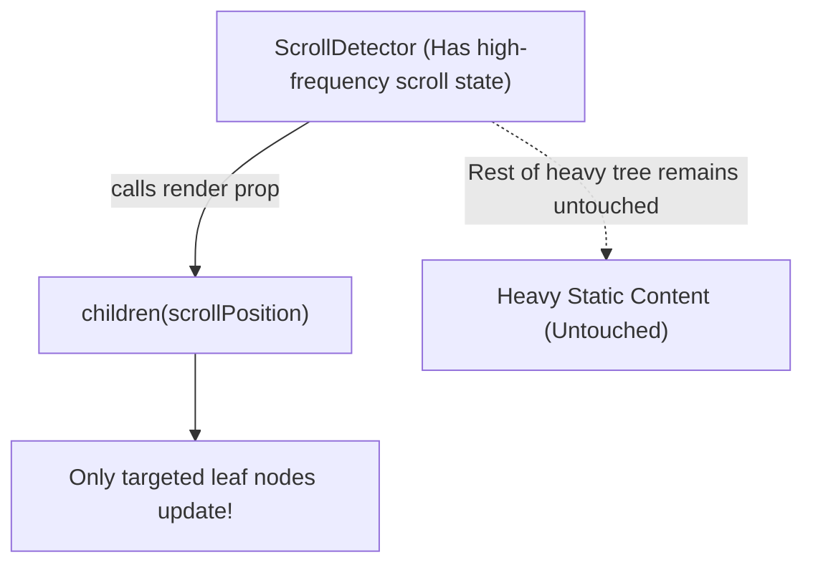

<div className="flex gap-2 mb-4">
  <Badge color="purple" size="sm">Inversion of Control</Badge>
  <Badge color="green" size="sm">Re-render Isolation</Badge>
  <Badge color="blue" size="sm">Performance Pattern</Badge>
</div>

<Card title="30-Second Senior Interview Pitch" icon="microphone">
  A Render Prop is a prop that receives a function returning a React Element, allowing a component to delegate rendering decisions to its consumer while encapsulating state management and side effects. While custom hooks largely replaced render props for sharing pure business logic and state, render props remain uniquely indispensable whenever a component needs to control WHERE, WHEN, or HOW elements are rendered in the DOM (such as virtualized lists, dropdown menus, and layout adapters).
</Card>

## Under The Hood (Fiber Engine & Architecture)



- Inversion of Control: The container manages state (e.g. coordinates, toggle status, animation ticks) and passes those variables as arguments into the render function.
- Execution on Every Render: Every time the container re-renders, it invokes the render prop function again. The function returns a new React Element tree with the latest state injected.
- Why Hooks Took Over State: Custom hooks avoid the "wrapper hell" (pyramids of nested ``) that rendered trees deep and hard to read in pre-hooks React.
- Where Render Props Still Win: Custom hooks CANNOT render JSX or control DOM wrapping. A VirtualizedList component must control the scroll wrapper and only render items currently visible in the viewport. Only a render prop `rowRenderer={({ index, style }) => ``}` can achieve this.

## Implementation Patterns & Approaches

<CodeGroup>
```tsx Pattern A: The render Prop
<DataProvider
  url="/api/users"
  render={({ data, loading }) => (
    loading ? <Spinner /> : <UserList users={data} />
  )}
/>
```

```tsx Pattern B: Children as a Function
<MouseTracker>
  {({ x, y }) => (
    <h1>Cursor is at ({x}, {y})</h1>
  )}
</MouseTracker>
```

</CodeGroup>

### Pattern A: The `render` Prop (Explicit Prop Name)

Pass the callback to an explicitly named prop like `render={data => ``}`.

**Advantages & When to Use:**
- Clear, unambiguous intent
- Can have multiple render props (e.g. renderHeader, renderBody, renderEmpty)

**Tradeoffs & Watch Out For:**
- Slightly more verbose than children

### Pattern B: Children as a Function (Idiomatic JSX Syntax)

Use the component's `children` prop as the render function.

**Advantages & When to Use:**
- Feels natural and integrated within JSX markup
- Widely used in modern libraries (Downshift, React Virtual, Formik)

**Tradeoffs & Watch Out For:**
- Limited to a single render function per component

## Pitfalls & Anti-Patterns

### ⚠️ Anti-Pattern: Using Render Props When a Custom Hook is Sufficient

<Warning>
  **Why It Breaks:** Creates an ugly pyramid of nested JSX wrappers that pollutes React DevTools, complicates debugging, and creates unnecessary component boundaries.
</Warning>

<CodeGroup>
```tsx Buggy Code
// ❌ Wrapper Hell: Using render props solely for state extraction
<WindowSize>
  {({ width }) => (
    <NetworkStatus>
      {({ isOnline }) => (
        <AuthConsumer>
          {({ user }) => (
            <Dashboard width={width} online={isOnline} user={user} />
          )}
        </AuthConsumer>
      )}
    </NetworkStatus>
  </WindowSize>
);
```

```tsx Senior Solution
// ✅ Clean & Flat with Custom Hooks
function DashboardContainer() {
  const width = useWindowWidth();
  const isOnline = useNetworkStatus();
  const user = useAuth();

  return <Dashboard width={width} online={isOnline} user={user} />;
}
```
</CodeGroup>

<Tip>
  **Senior Explanation:** If all you need is data or state logic, use a custom hook. Only use render props when the container must control the physical rendering, layout, or DOM instantiation of elements.
</Tip>

## Senior Interview Q&A

<AccordionGroup>
  <Accordion title="Q: Why did React Hooks replace render props for state sharing, and when are render props still needed? (Tricky Level)">
    Hooks replaced render props for state sharing because hooks flatten the component tree, avoiding the dreaded "render prop wrapper hell" and allowing multiple stateful abstractions to compose linearly inside a single function component. However, render props are still needed whenever a component must control the rendering and layout of UI—such as virtualized list row renderers, autocomplete dropdown item wrappers, or chart legends.
  </Accordion>
</AccordionGroup>

## Complete Playground Component

<CodeGroup>
```tsx 01-render-props-pattern.tsx
import React, { useState } from 'react';
import { RenderCounter } from '../../../components/ui/RenderCounter';
import { MousePointer, Eye, ToggleLeft, ToggleRight } from 'lucide-react';

// Render prop component that tracks mouse position locally
const MouseTracker: React.FC<{
  render: (pos: { x: number; y: number }) => React.ReactNode;
}> = ({ render }) => {
  const [pos, setPos] = useState({ x: 0, y: 0 });

  const handleMouseMove = (e: React.MouseEvent<HTMLDivElement>) => {
    const rect = e.currentTarget.getBoundingClientRect();
    setPos({
      x: Math.round(e.clientX - rect.left),
      y: Math.round(e.clientY - rect.top),
    });
  };

  return (
    <div
      onMouseMove={handleMouseMove}
      className="border border-stone-300 dark:border-stone-700 bg-stone-50 dark:bg-stone-950 p-6 min-h-[160px] relative overflow-hidden flex flex-col justify-between"
    >
      <div className="flex items-center justify-between">
        <span className="text-xs uppercase font-mono text-stone-500">
          Mouse Hover Canvas
        </span>
        <RenderCounter name="MouseTracker" />
      </div>

      {/* Render prop invocation */}
      {render(pos)}

      <span className="text-[11px] font-mono text-stone-400">
        Move your cursor inside this container
      </span>
    </div>
  );
};

// Render prop component for Toggle state machine
const ToggleController: React.FC<{
  children: (state: { on: boolean; toggle: () => void }) => React.ReactNode;
}> = ({ children }) => {
  const [on, setOn] = useState(false);
  const toggle = () => setOn((prev) => !prev);
  return <>{children({ on, toggle })}</>;
};

export default function RenderPropsDemo() {
  const [viewStyle, setViewStyle] = useState<'coordinates' | 'indicator'>(
    'coordinates'
  );

  return (
    <div className="space-y-6">
      <div className="flex items-center justify-between pb-3 border-b border-stone-200 dark:border-stone-800">
        <div>
          <h4 className="text-xs font-mono uppercase text-stone-500">
            Render Props & Inversion of Control
          </h4>
          <p className="text-xs text-stone-400 mt-1">
            Consumer dictates the visual layout; container encapsulates the
            tracking mechanics.
          </p>
        </div>
        <div className="flex items-center gap-2">
          <button
            onClick={() => setViewStyle('coordinates')}
            className={`px-2.5 py-1 text-xs font-mono uppercase border ${
              viewStyle === 'coordinates'
                ? 'border-[#C8102E] bg-[#C8102E]/10 text-[#C8102E]'
                : 'border-stone-200 dark:border-stone-800 text-stone-500'
            }`}
          >
            Numeric View
          </button>
          <button
            onClick={() => setViewStyle('indicator')}
            className={`px-2.5 py-1 text-xs font-mono uppercase border ${
              viewStyle === 'indicator'
                ? 'border-[#C8102E] bg-[#C8102E]/10 text-[#C8102E]'
                : 'border-stone-200 dark:border-stone-800 text-stone-500'
            }`}
          >
            Visual Tracker
          </button>
        </div>
      </div>

      {/* MouseTracker with Consumer-Injected Render */}
      <MouseTracker
        render={({ x, y }) =>
          viewStyle === 'coordinates' ? (
            <div className="p-3 bg-stone-200/50 dark:bg-stone-800/50 border border-stone-300 dark:border-stone-700 w-fit">
              <div className="text-xs font-mono tabular-nums text-stone-900 dark:text-stone-50">
                X: {x}px | Y: {y}px
              </div>
            </div>
          ) : (
            <div
              style={{
                transform: `translate(${x}px, ${y}px)`,
                transition: 'transform 0.05s ease-out',
              }}
              className="absolute pointer-events-none w-6 h-6 border-2 border-[#C8102E] flex items-center justify-center -ml-3 -mt-3"
            >
              <MousePointer className="w-3 h-3 text-[#C8102E]" />
            </div>
          )
        }
      />

      {/* Children as a Function (ToggleController) */}
      <div className="border border-stone-200 dark:border-stone-800 p-4 bg-stone-100/40 dark:bg-stone-900/40 space-y-3">
        <span className="text-xs font-mono uppercase text-stone-500 block">
          Children as a Function Pattern
        </span>
        <ToggleController>
          {({ on, toggle }) => (
            <div className="flex items-center justify-between">
              <div className="flex items-center gap-2">
                <Eye className="w-4 h-4 text-stone-400" />
                <span className="text-xs text-stone-900 dark:text-stone-100 font-medium">
                  Visibility Status: {on ? 'Revealed' : 'Masked'}
                </span>
              </div>
              <button
                onClick={toggle}
                className="px-3 py-1.5 bg-stone-900 dark:bg-stone-50 text-stone-50 dark:text-stone-900 text-xs flex items-center gap-1.5"
              >
                {on ? (
                  <ToggleRight className="w-4 h-4 text-emerald-400" />
                ) : (
                  <ToggleLeft className="w-4 h-4" />
                )}
                <span>Toggle State</span>
              </button>
            </div>
          )}
        </ToggleController>
      </div>
    </div>
  );
}
```
</CodeGroup>
