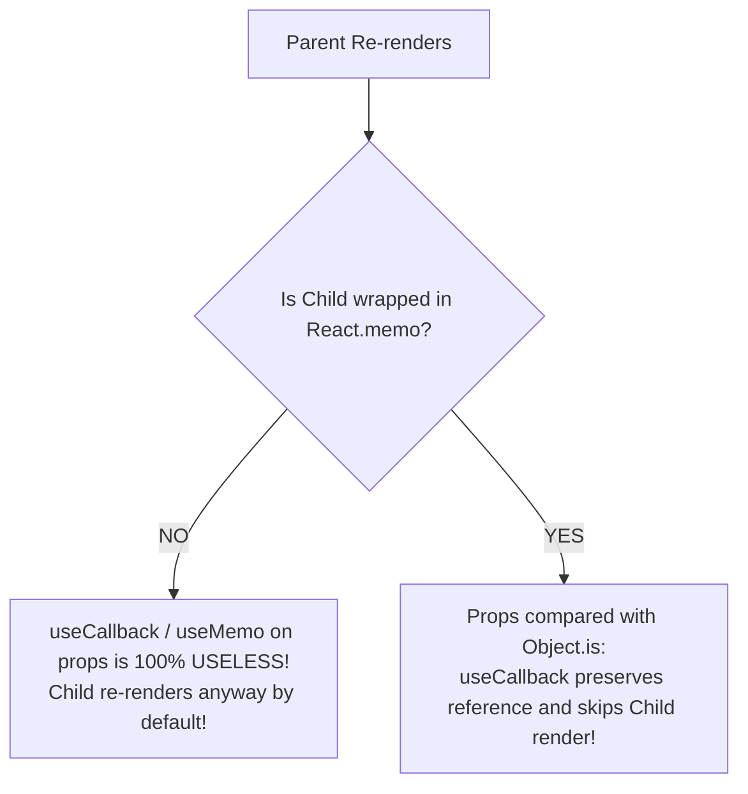

<div className="flex gap-2 mb-4">
  <Badge color="red" size="sm">The Memoization Trap</Badge>
  <Badge color="blue" size="sm">React.memo Pair</Badge>
  <Badge color="purple" size="sm">Staff Performance Insight</Badge>
</div>

<Card title="30-Second Senior Interview Pitch" icon="microphone">
  One of the most widespread antipatterns in the React ecosystem is wrapping objects in useMemo and callbacks in useCallback 'to optimize props', while passing them to a child component that is NOT wrapped in React.memo! Remember the golden rule: When a parent renders, children re-render by default regardless of props. Memoizing props passed to an unmemoized child does not prevent a single re-render; it only adds memory allocations and dependency comparison overhead. useMemo/useCallback on props ONLY has a performance effect when the receiving child is wrapped in React.memo or used in another hook's dependency array.
</Card>

## Under The Hood (Fiber Engine & Architecture)



- Normal Component Flow: React calls `Component(props)`. It does NOT compare previous props to next props. If the parent executes, the child executes. Period.
- React.memo Flow: When a component is wrapped in `React.memo`, React intercepts the render and runs `shallowCompare(prevProps, nextProps)` using `Object.is()`. If all keys evaluate to true, React returns the cached Fiber output and skips executing the component.
- The Wasted Work Equation: Wrapping in useMemo/useCallback costs CPU time to instantiate closure caches and check dependencies. If the receiving component does not compare those props, you have paid the cost of memoization with zero return on investment.
- When is useMemo without React.memo valid? ONLY when: 1. The calculation itself is genuinely expensive (e.g. sorting 10,000 items), or 2. The memoized value is passed as a dependency to useEffect, useMemo, or useCallback.

## Implementation Patterns & Approaches

<CodeGroup>
```tsx Pattern A: No Memoization Default for 95% of components
function Parent() {
  const [count, setCount] = useState(0);

  // Clean, no boilerplate
  return (
    <div>
      <button onClick={() => setCount(c => c + 1)}>Count: {count}</button>
      <StandardButton onClick={() => alert('Clicked')} />
    </div>
  );
}
```

```tsx Pattern B: Full Memoization Pair React.memo + useCallback
// Child MUST be wrapped in React.memo
const HeavyDataGrid = React.memo(function HeavyDataGrid({
  data,
  onRowSelect,
}: {
  data: Row[];
  onRowSelect: (id: string) => void;
}) {
  return <table>...</table>;
});

function Parent() {
  const [filter, setFilter] = useState('');

  // Props MUST be memoized to preserve referential equality
  const memoizedData = useMemo(() => filterData(allData, filter), [filter]);
  const handleRowSelect = useCallback((id: string) => {
    selectRow(id);
  }, []);

  return <HeavyDataGrid data={memoizedData} onRowSelect={handleRowSelect} />;
}
```

</CodeGroup>

### Pattern A: No Memoization (Default for 95% of components) (Simplest & Recommended)

Pass standard inline callbacks and objects when components are lightweight. The overhead of rendering light JSX is lower than the overhead of memoization.

**Advantages & When to Use:**
- Zero cognitive overhead
- No dependency array maintenance or stale closure bugs
- Cleaner, shorter code

**Tradeoffs & Watch Out For:**
- Component re-renders when parent re-renders (fine for 95% of UI)

### Pattern B: Full Memoization Pair (React.memo + useCallback) (Intentional Optimization)

Wrap the heavy child in `React.memo` AND wrap all passed functions in `useCallback` and objects in `useMemo`.

**Advantages & When to Use:**
- Actually prevents re-renders of the heavy component
- Measurable rendering speedup on complex subtrees

**Tradeoffs & Watch Out For:**
- High maintenance: any missed prop breaks memoization
- Adds memory and dependency tracking overhead

## Pitfalls & Anti-Patterns

### ⚠️ Anti-Pattern: Wrapping Every Callback in useCallback Without React.memo

<Warning>
  **Why It Breaks:** Native DOM elements (like ``) and unmemoized React components do not check whether onClick changed before rendering. Wrapping handleSubmit in useCallback does not save a single millisecond; it strictly adds overhead.
</Warning>

<CodeGroup>
```tsx Buggy Code
function UserPage() {
  const [search, setSearch] = useState('');

  // ❌ WASTED WORK: Passed to a standard <button> or unmemoized component!
  const handleSubmit = useCallback(() => {
    submitSearch(search);
  }, [search]);

  return (
    <div>
      <input value={search} onChange={e => setSearch(e.target.value)} />
      {/* Native HTML elements and normal components do not do shallow prop comparison! */}
      <button onClick={handleSubmit}>Submit</button>
      <StandardCard onSubmit={handleSubmit} />
    </div>
  );
}
```

```tsx Senior Solution
function UserPage() {
  const [search, setSearch] = useState('');

  // ✅ Clean, straightforward inline handler
  const handleSubmit = () => {
    submitSearch(search);
  };

  return (
    <div>
      <input value={search} onChange={e => setSearch(e.target.value)} />
      <button onClick={handleSubmit}>Submit</button>
      <StandardCard onSubmit={handleSubmit} />
    </div>
  );
}
```
</CodeGroup>

<Tip>
  **Senior Explanation:** Never wrap callbacks in useCallback by default. Only use useCallback when: 1) The callback is passed to a component wrapped in React.memo, or 2) The callback is in a useEffect dependency array.
</Tip>

## Senior Interview Q&A

<AccordionGroup>
  <Accordion title="Q: Does wrapping a callback in useCallback prevent the component from re-rendering? (Common Level)">
    No! `useCallback` does NOT prevent the host component or the receiving child component from re-rendering. It only preserves the memory reference of the function across renders. If the child component receiving that callback is not wrapped in `React.memo`, the child will re-render whenever the parent renders regardless of `useCallback`.
  </Accordion>
  <Accordion title="Q: What are the only two legitimate use cases for useCallback in React? (Senior Level)">
    1. Passing a callback to an expensive child component that is wrapped in `React.memo` (so shallow prop comparison evaluates to true and skips re-rendering). 2. Passing a callback into the dependency array of a `useEffect` or custom hook (to prevent the effect from re-running on every render). Any other use of `useCallback` is unnecessary overhead.
  </Accordion>
</AccordionGroup>

## Complete Playground Component

<CodeGroup>
```tsx 02-antipattern-memoizing-props.tsx
import React, { useState, useMemo, useCallback } from 'react';
import { RenderCounter } from '../../../components/ui/RenderCounter';
import { AlertCircle, CheckCircle } from 'lucide-react';

// Unmemoized Child
const UnmemoizedChild: React.FC<{
  config: { role: string };
  onAction: () => void;
}> = ({ config, onAction }) => {
  return (
    <div className="border border-[#C8102E]/30 bg-[#C8102E]/5 p-4 space-y-2">
      <div className="flex items-center justify-between">
        <span className="text-xs font-mono text-[#C8102E] font-medium">
          Regular Child (NOT wrapped in React.memo)
        </span>
        <RenderCounter name="UnmemoizedChild" />
      </div>
      <p className="text-xs text-stone-500">
        Role: {config.role}. Parent memoized the props with useMemo/useCallback,
        but because this child is NOT wrapped in React.memo, it re-renders EVERY
        single time parent updates!
      </p>
      <button
        onClick={onAction}
        className="px-2.5 py-1 text-xs border border-stone-300 dark:border-stone-700 bg-stone-50 dark:bg-stone-950 font-mono"
      >
        Click Action
      </button>
    </div>
  );
};

// Properly Memoized Child with React.memo
const MemoizedChild = React.memo<{
  config: { role: string };
  onAction: () => void;
}>(({ config, onAction }) => {
  return (
    <div className="border border-emerald-500/30 bg-emerald-500/5 p-4 space-y-2">
      <div className="flex items-center justify-between">
        <span className="text-xs font-mono text-emerald-700 dark:text-emerald-400 font-medium">
          ✅ Wrapped in React.memo
        </span>
        <RenderCounter name="MemoizedChild" />
      </div>
      <p className="text-xs text-stone-500">
        Role: {config.role}. Because props are stable (via useMemo/useCallback)
        AND this component is wrapped in React.memo, it completely bails out of
        re-renders!
      </p>
      <button
        onClick={onAction}
        className="px-2.5 py-1 text-xs border border-stone-300 dark:border-stone-700 bg-stone-50 dark:bg-stone-950 font-mono"
      >
        Click Action
      </button>
    </div>
  );
});

export default function MemoizingPropsAntipatternDemo() {
  const [count, setCount] = useState(0);

  // Memoized props
  const config = useMemo(() => ({ role: 'Admin' }), []);
  const handleAction = useCallback(() => {
    // stable callback
  }, []);

  return (
    <div className="space-y-6">
      <div className="flex items-center justify-between pb-3 border-b border-stone-200 dark:border-stone-800">
        <div>
          <h4 className="text-xs font-mono uppercase text-stone-500">
            Investigation: The Myth of Memoizing Props
          </h4>
          <p className="text-xs text-stone-400 mt-1">
            Click "Trigger Parent Re-render". Watch how UnmemoizedChild flashes
            even though its props are memoized!
          </p>
        </div>
        <button
          onClick={() => setCount((c) => c + 1)}
          className="px-3 py-1.5 bg-stone-900 dark:bg-stone-50 text-stone-50 dark:text-stone-900 text-xs font-medium font-mono"
        >
          Trigger Parent Re-render ({count})
        </button>
      </div>

      <div className="grid grid-cols-1 md:grid-cols-2 gap-6">
        {/* The Antipattern */}
        <div className="space-y-2">
          <div className="flex items-center gap-1.5 text-xs font-mono text-[#C8102E] font-medium">
            <AlertCircle className="w-4 h-4" />
            <span>The Wasted Memoization Antipattern</span>
          </div>
          <UnmemoizedChild config={config} onAction={handleAction} />
        </div>

        {/* The Working Solution */}
        <div className="space-y-2">
          <div className="flex items-center gap-1.5 text-xs font-mono text-emerald-600 dark:text-emerald-400 font-medium">
            <CheckCircle className="w-4 h-4" />
            <span>useMemo + React.memo Paired Together</span>
          </div>
          <MemoizedChild config={config} onAction={handleAction} />
        </div>
      </div>
    </div>
  );
}
```
</CodeGroup>
