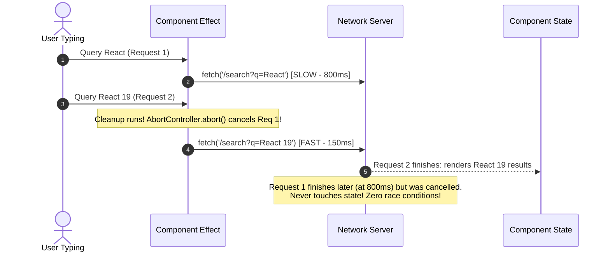

<div className="flex gap-2 mb-4">
  <Badge color="blue" size="sm">Network Resilience</Badge>
  <Badge color="orange" size="sm">AbortSignal</Badge>
  <Badge color="green" size="sm">Senior Production</Badge>
</div>

<Card title="30-Second Senior Interview Pitch" icon="microphone">
  A Race Condition in React data fetching occurs when multiple asynchronous network requests are triggered in sequence, and due to variable network latency, an older request completes AFTER a newer request. Because promises resolve asynchronously, the outdated response overrides the latest UI state—showing the wrong user profile, wrong search results, or wrong active tab! The production-grade senior solution is using `AbortController` inside `useEffect` cleanup. When dependencies change or the component unmounts, the in-flight fetch request is immediately cancelled at the browser network layer.
</Card>

## Under The Hood (Fiber Engine & Architecture)



- Network Non-Determinism: Request A is fired at t=0s (latency 2000ms). User clicks Tab B at t=0.5s, firing Request B (latency 300ms). Request B resolves at t=0.8s, displaying Tab B. At t=2.0s, Request A finally resolves, overwriting Tab B with outdated Tab A data!
- The 4 Solutions to Race Conditions (from reference.pdf Ch 15):
- 1. Force Remounting with `key={id}`: React unmounts the previous component instance; its setState becomes a no-op.
- 2. Boolean Flag in Cleanup: `let active = true; ... return () => { active = false; };` Inside promise `.then()`, check `if (active) setState(data);`. Drop incorrect result.
- 3. Timestamp / ID Tracking with `useRef`: Track `latestRequestId.current = id;` and verify ID before setting state.
- 4. AbortController: Pass `signal: controller.signal` to `fetch()`, call `controller.abort()` in cleanup. Cancels network payload and frees browser memory immediately.

## Implementation Patterns & Approaches

<CodeGroup>
```tsx Pattern A: The AbortController Pattern Best Practice
useEffect(() => {
  const controller = new AbortController();

  fetch(`/api/user/${userId}`, { signal: controller.signal })
    .then(res => res.json())
    .then(data => setUser(data))
    .catch(err => {
      if (err.name !== 'AbortError') {
        setError(err);
      }
    });

  return () => {
    controller.abort(); // Cancel request when userId changes or unmounts!
  };
}, [userId]);
```

```tsx Pattern B: The Boolean Flag Cleanup Pattern
useEffect(() => {
  let isCurrent = true;

  someAsyncOperation(userId).then(data => {
    if (isCurrent) {
      setUser(data);
    }
  });

  return () => {
    isCurrent = false; // Ignore stale result if user changed!
  };
}, [userId]);
```

</CodeGroup>

### Pattern A: The `AbortController` Pattern (Best Practice) (Browser Native & Cleanest)

Cancel the network request directly using native Web API AbortController.

**Advantages & When to Use:**
- Actually aborts network transfer, saving user bandwidth and CPU
- Native Web API built into all modern browsers
- Zero race conditions possible

**Tradeoffs & Watch Out For:**
- Must filter out `AbortError` in catch block

### Pattern B: The Boolean Flag Cleanup Pattern (For Non-Cancellable Promises)

When using libraries or promises that do not accept an AbortSignal.

**Advantages & When to Use:**
- Works with any Promise, SDK, or async function
- Simple to write and understand

**Tradeoffs & Watch Out For:**
- Request still completes in the background over the network

## Pitfalls & Anti-Patterns

### ⚠️ Anti-Pattern: Unchecked useEffect Fetching Without Cleanup

<Warning>
  **Why It Breaks:** Typing "cat" fires 3 requests: "c", "ca", "cat". If the response for "c" takes 1.5s and "cat" takes 200ms, the user sees results for "cat" briefly flash, only to be overwritten by results for "c"!
</Warning>

<CodeGroup>
```tsx Buggy Code
function SearchResults({ query }: { query: string }) {
  const [results, setResults] = useState([]);

  // ❌ DISASTER: Race condition on every keystroke!
  useEffect(() => {
    fetch(`/api/search?q=${query}`)
      .then(res => res.json())
      .then(data => setResults(data));
  }, [query]);

  return <List items={results} />;
}
```

```tsx Senior Solution
useEffect(() => {
  const controller = new AbortController();

  fetch(`/api/search?q=${query}`, { signal: controller.signal })
    .then(res => res.json())
    .then(data => setResults(data))
    .catch(err => {
      if (err.name !== 'AbortError') console.error(err);
    });

  return () => controller.abort();
}, [query]);
```
</CodeGroup>

<Tip>
  **Senior Explanation:** Always provide a cleanup cancellation mechanism when fetching inside useEffect, or use a query library like TanStack Query / modern React 19 Actions.
</Tip>

## Senior Interview Q&A

<AccordionGroup>
  <Accordion title="Q: What is an async race condition in React, and how can you demonstrate it in an interview? (Senior Level)">
    A race condition occurs when two or more asynchronous operations are launched sequentially, and the older operation finishes after the newer operation. If both operations update the same component state, the older (stale) data overwrites the newer data. To demonstrate: simulate fetching user profile #1 with 2000ms delay, and then immediately user profile #2 with 300ms delay. Without cancellation, profile #1 will arrive last and display on screen even though the active selection is profile #2.
  </Accordion>
  <Accordion title="Q: How do you handle the error thrown when controller.abort() is called on a fetch request? (Tricky Level)">
    When `controller.abort()` is called, `fetch()` immediately rejects with a `DOMException` whose `name` property is `"AbortError"`. In the promise `.catch()` or `try/catch` block, check `if (error.name === "AbortError")` and silently ignore it, because an aborted request is an intentional cancellation, not an application failure.
  </Accordion>
</AccordionGroup>

## Complete Playground Component

<CodeGroup>
```tsx 02-race-conditions-and-abortcontroller.tsx
import { useState, useEffect } from 'react';
import { RenderCounter } from '../../../components/ui/RenderCounter';

interface UserData {
  id: string;
  name: string;
  avatar: string;
  latencyMs: number;
}

// Mock API simulating network latency
const mockFetchUser = (id: string, signal?: AbortSignal): Promise<UserData> => {
  const latency = id === 'user-slow-1' ? 2500 : 500;

  return new Promise((resolve, reject) => {
    const timer = setTimeout(() => {
      resolve({
        id,
        name:
          id === 'user-slow-1'
            ? 'User #1 (Slow 2.5s Response)'
            : 'User #2 (Fast 500ms Response)',
        avatar: id === 'user-slow-1' ? '🐢' : '⚡',
        latencyMs: latency,
      });
    }, latency);

    if (signal) {
      signal.addEventListener('abort', () => {
        clearTimeout(timer);
        reject(new DOMException('Request aborted by controller', 'AbortError'));
      });
    }
  });
};

export default function RaceConditionsDemo() {
  const [strategy, setStrategy] = useState<'buggy' | 'abortController'>(
    'buggy'
  );
  const [selectedUserId, setSelectedUserId] = useState<string>('user-slow-1');
  const [displayUser, setDisplayUser] = useState<UserData | null>(null);
  const [isLoading, setIsLoading] = useState(false);
  const [logMessages, setLogMessages] = useState<string[]>([]);

  const addLog = (msg: string) => {
    setLogMessages((prev) => [
      `[${new Date().toLocaleTimeString()}] ${msg}`,
      ...prev.slice(0, 7),
    ]);
  };

  // 1. Buggy Approach: No cleanup or cancellation!
  useEffect(() => {
    if (strategy !== 'buggy') return;

    setIsLoading(true);
    addLog(`🚀 Initiated request for ${selectedUserId} (No cancellation)`);

    mockFetchUser(selectedUserId)
      .then((data) => {
        setDisplayUser(data);
        setIsLoading(false);
        addLog(`✅ COMPLETED: Rendered data for ${data.id} (${data.name})`);
      })
      .catch((err) => {
        addLog(`❌ Error: ${err.message}`);
        setIsLoading(false);
      });
  }, [selectedUserId, strategy]);

  // 2. Fixed Approach: AbortController cancels stale pending requests!
  useEffect(() => {
    if (strategy !== 'abortController') return;

    const controller = new AbortController();
    setIsLoading(true);
    addLog(`🚀 Initiated request for ${selectedUserId} with AbortController`);

    mockFetchUser(selectedUserId, controller.signal)
      .then((data) => {
        setDisplayUser(data);
        setIsLoading(false);
        addLog(`✅ COMPLETED: Rendered data for ${data.id}`);
      })
      .catch((err) => {
        if (err.name === 'AbortError') {
          addLog(
            `🛑 CANCELLED: Outdated request for ${selectedUserId} was cleanly aborted!`
          );
        } else {
          addLog(`❌ Error: ${err.message}`);
          setIsLoading(false);
        }
      });

    return () => {
      // Abort the previous in-flight request when user changes!
      controller.abort();
    };
  }, [selectedUserId, strategy]);

  return (
    <div className="space-y-6">
      <div className="flex items-center justify-between pb-3 border-b border-stone-200 dark:border-stone-800">
        <div>
          <h4 className="text-xs font-mono uppercase text-stone-500">
            Investigation: The Async Network Race Condition
          </h4>
          <p className="text-xs text-stone-400 mt-1">
            Test instructions: Click <strong>"User 1 (Slow)"</strong>, then
            immediately click <strong>"User 2 (Fast)"</strong>.
          </p>
        </div>
        <div className="flex items-center gap-2">
          <button
            onClick={() => {
              setStrategy('buggy');
              setLogMessages([]);
            }}
            className={`px-3 py-1 text-xs font-mono uppercase border ${
              strategy === 'buggy'
                ? 'border-[#C8102E] bg-[#C8102E]/10 text-[#C8102E] font-medium'
                : 'border-stone-200 dark:border-stone-800 text-stone-500'
            }`}
          >
            ❌ Buggy (No Cleanup)
          </button>
          <button
            onClick={() => {
              setStrategy('abortController');
              setLogMessages([]);
            }}
            className={`px-3 py-1 text-xs font-mono uppercase border ${
              strategy === 'abortController'
                ? 'border-emerald-500 bg-emerald-500/10 text-emerald-700 dark:text-emerald-400 font-medium'
                : 'border-stone-200 dark:border-stone-800 text-stone-500'
            }`}
          >
            ✅ Fixed (AbortController)
          </button>
        </div>
      </div>

      {/* Trigger Buttons */}
      <div className="flex flex-wrap items-center gap-3">
        <button
          onClick={() => setSelectedUserId('user-slow-1')}
          className={`px-4 py-2 text-xs font-mono border flex items-center gap-2 ${
            selectedUserId === 'user-slow-1'
              ? 'border-[#C8102E] bg-[#C8102E]/10 text-[#C8102E]'
              : 'border-stone-300 dark:border-stone-700 bg-stone-100 dark:bg-stone-900 text-stone-700 dark:text-stone-300'
          }`}
        >
          <span>🐢 User #1 (Slow 2500ms)</span>
        </button>
        <button
          onClick={() => setSelectedUserId('user-fast-2')}
          className={`px-4 py-2 text-xs font-mono border flex items-center gap-2 ${
            selectedUserId === 'user-fast-2'
              ? 'border-emerald-500 bg-emerald-500/10 text-emerald-700 dark:text-emerald-400'
              : 'border-stone-300 dark:border-stone-700 bg-stone-100 dark:bg-stone-900 text-stone-700 dark:text-stone-300'
          }`}
        >
          <span>⚡ User #2 (Fast 500ms)</span>
        </button>
        <RenderCounter name="RacePlayground" />
      </div>

      {/* Active Rendered Data Result */}
      <div className="p-5 border border-stone-200 dark:border-stone-800 bg-stone-100/50 dark:bg-stone-900/50 space-y-2">
        <div className="flex items-center justify-between">
          <span className="text-xs uppercase font-mono text-stone-500">
            Currently Rendered UI Output
          </span>
          {isLoading && (
            <span className="text-xs font-mono text-[#C8102E] animate-pulse">
              Network Fetch In-Flight…
            </span>
          )}
        </div>
        {displayUser ? (
          <div className="flex items-center gap-3 p-3 bg-stone-50 dark:bg-stone-950 border border-stone-200 dark:border-stone-800">
            <span className="text-2xl">{displayUser.avatar}</span>
            <div>
              <h5 className="text-xs font-semibold text-stone-900 dark:text-stone-100">
                {displayUser.name}
              </h5>
              <span className="text-[11px] font-mono text-stone-500">
                Data ID: {displayUser.id} (Responded in {displayUser.latencyMs}
                ms)
              </span>
            </div>
          </div>
        ) : (
          <div className="p-3 text-xs text-stone-400 font-mono">
            No data loaded yet.
          </div>
        )}
      </div>

      {/* Network Events Console Log */}
      <div className="border border-stone-200 dark:border-stone-800 bg-stone-950 p-4 font-mono text-xs text-stone-300 space-y-1">
        <div className="flex items-center justify-between text-stone-500 pb-2 mb-2 border-b border-stone-800 text-[11px] uppercase tracking-widest">
          <span>Network Event Timeline</span>
          <button
            onClick={() => setLogMessages([])}
            className="hover:text-stone-200 text-[10px]"
          >
            Clear Log
          </button>
        </div>
        {logMessages.length === 0 ? (
          <span className="text-stone-600">
            Click a user button above to begin simulation…
          </span>
        ) : (
          logMessages.map((log, i) => (
            <div key={i} className="leading-relaxed">
              {log}
            </div>
          ))
        )}
      </div>
    </div>
  );
}
```
</CodeGroup>
