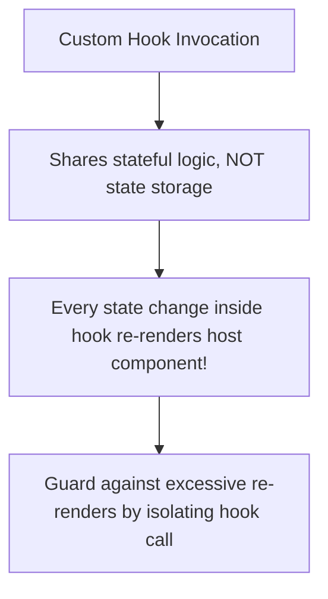

<div className="flex gap-2 mb-4">
  <Badge color="green" size="sm">Custom Hook Architecture</Badge>
  <Badge color="blue" size="sm">Concurrency-Safe</Badge>
  <Badge color="purple" size="sm">Staff Best Practices</Badge>
</div>

<Card title="30-Second Senior Interview Pitch" icon="microphone">
  Custom hooks let you extract component logic into reusable functions with full access to React state and effect lifecycles. In production and senior interviews, you are expected to write hooks that prevent memory leaks (proper clearTimeout in effects), handle SSR gracefully (window checks for localStorage), and leverage the commit timing of refs (such as usePrevious capturing pre-commit values).
</Card>

## Under The Hood (Fiber Engine & Architecture)



- Custom hooks do not share state instances—they share stateful logic. Calling `useCounter` in Component A and Component B allocates separate Fiber hook records for each component.
- Hooks must start with "use" so the React linter can enforce the Rules of Hooks (only call at top level, never inside loops/conditions).
- The execution order of hooks in a component is fixed. React relies on an internal cursor array to associate hook calls with their corresponding Fiber node linked-list entries.
- In `usePrevious`, the order is: 1) Component renders, returning `ref.current` (old value). 2) Browser paints. 3) `useEffect` executes, updating `ref.current = value` for the next render.

## Implementation Patterns & Approaches

<CodeGroup>
```tsx useDebounce Value Debounce
function useDebounce<T>(value: T, delay: number): T {
  const [debouncedValue, setDebouncedValue] = useState<T>(value);

  useEffect(() => {
    const handler = setTimeout(() => {
      setDebouncedValue(value);
    }, delay);

    // CRITICAL: Cleanup cancels timer on rapid keystrokes!
    return () => clearTimeout(handler);
  }, [value, delay]);

  return debouncedValue;
}
```

```tsx usePrevious Ref Commit Timing
function usePrevious<T>(value: T): T | undefined {
  const ref = useRef<T>(undefined);

  // useEffect runs AFTER the render is painted to DOM:
  useEffect(() => {
    ref.current = value;
  }, [value]);

  // Returned during render BEFORE the effect updates ref:
  return ref.current;
}
```

```tsx useLocalStorage Resilient Persistence
function useLocalStorage<T>(key: string, initialValue: T) {
  const [storedValue, setStoredValue] = useState<T>(() => {
    if (typeof window === 'undefined') return initialValue;
    try {
      const item = window.localStorage.getItem(key);
      return item ? JSON.parse(item) : initialValue;
    } catch {
      return initialValue;
    }
  });

  const setValue = (val: T | ((prev: T) => T)) => {
    const nextVal = val instanceof Function ? val(storedValue) : val;
    setStoredValue(nextVal);
    if (typeof window !== 'undefined') {
      window.localStorage.setItem(key, JSON.stringify(nextVal));
    }
  };

  return [storedValue, setValue] as const;
}
```

</CodeGroup>

### useDebounce (Value Debounce) (Timer Lifecycle)

Debounces a primitive or object value by delaying state synchronization until input typing has paused for the designated delay.

**Advantages & When to Use:**
- Guaranteed cleanup prevents memory leaks on component unmount
- Works with any data type via TypeScript generic ``
- Allows clean separation of immediate typing feedback from delayed API fetch

**Tradeoffs & Watch Out For:**
- Triggers an additional re-render when the debounce timer fires

### usePrevious (Ref Commit Timing) (Ref Heuristic)

Tracks the value from the previous render cycle using the execution timing disparity between the render phase and post-commit useEffect.

**Advantages & When to Use:**
- Zero extra re-renders (updating ref does not trigger render)
- Extremely lightweight and elegant way to diff current vs previous props/state

**Tradeoffs & Watch Out For:**
- Undefined on the initial mount render (must be accounted for)

### useLocalStorage (Resilient Persistence) (Browser Storage)

Syncs React state with localStorage, supporting functional updates, JSON serialization error catching, and SSR safety.

**Advantages & When to Use:**
- Lazy initial state function avoids blocking localStorage read on subsequent renders
- Protected against JSON parse syntax errors and SSR window undefined errors

**Tradeoffs & Watch Out For:**
- localStorage is synchronous on the main thread; avoid storing megabyte payloads

## Pitfalls & Anti-Patterns

### ⚠️ Anti-Pattern: Missing Timer Cleanup in Debounce Hook

<Warning>
  **Why It Breaks:** Without a cleanup function, typing "react" schedules 5 distinct timers that ALL execute 400ms later, triggering multiple cascading delayed state updates.
</Warning>

<CodeGroup>
```tsx Buggy Code
function useDebounce(value, delay) {
  const [debounced, setDebounced] = useState(value);

  useEffect(() => {
    // BUG: Missing return () => clearTimeout(timer)
    setTimeout(() => {
      setDebounced(value);
    }, delay);
  }, [value, delay]);

  return debounced;
}
```

```tsx Senior Solution
function useDebounce(value, delay) {
  const [debounced, setDebounced] = useState(value);

  useEffect(() => {
    const timer = setTimeout(() => {
      setDebounced(value);
    }, delay);

    // FIX: Clear pending timer before starting a new one
    return () => clearTimeout(timer);
  }, [value, delay]);

  return debounced;
}
```
</CodeGroup>

<Tip>
  **Senior Explanation:** Returning a cleanup callback cancels the unfulfilled timer from the previous effect invocation before the new effect runs, ensuring only the terminal idle keystroke executes.
</Tip>

### ⚠️ Anti-Pattern: Reading localStorage Synchronously in the Render Body

<Warning>
  **Why It Breaks:** localStorage is a synchronous disk read on the browser main thread. Reading it on every render stalls JavaScript execution and degrades frame rates.
</Warning>

<CodeGroup>
```tsx Buggy Code
function useStorage(key, fallback) {
  // BUG: Executes window.localStorage.getItem on EVERY SINGLE render!
  const saved = JSON.parse(localStorage.getItem(key)) || fallback;
  const [val, setVal] = useState(saved);
  // ...
}
```

```tsx Senior Solution
function useStorage(key, fallback) {
  // FIX: Pass lazy initializer function to useState
  const [val, setVal] = useState(() => {
    try {
      const item = localStorage.getItem(key);
      return item ? JSON.parse(item) : fallback;
    } catch {
      return fallback;
    }
  });
  // ...
}
```
</CodeGroup>

<Tip>
  **Senior Explanation:** Passing a lazy initializer function to useState ensures the expensive synchronous localStorage lookup only executes once during initial component mount.
</Tip>

## Senior Interview Q&A

<AccordionGroup>
  <Accordion title="Q: How does usePrevious work without causing an infinite render loop? (Senior Level)">
    Because `usePrevious` stores the value in a `useRef`. Mutating `ref.current` does not trigger a re-render. During the render phase, the hook returns the ref’s current value (which holds the previous render’s number). Then, after React commits to the DOM, the `useEffect` runs and assigns the new prop value into `ref.current`. On the subsequent render, the ref now holds that saved value.
  </Accordion>
  <Accordion title="Q: Why should you pass a function to useState when initializing from localStorage? (Common Level)">
    Calling `localStorage.getItem` directly as `useState(localStorage.getItem(...))` causes JavaScript to perform a synchronous disk I/O operation on EVERY render of the component, even though the return value is only used on the very first mount. Passing a lazy initializer function `useState(() => localStorage.getItem(...))` guarantees the disk read only executes once during initial mount.
  </Accordion>
  <Accordion title="Q: What happens if you do not return a cleanup function from the useEffect inside useDebounce? (Common Level)">
    Every keystroke will spawn a separate `setTimeout` that runs to completion. If you type 10 characters rapidly, 10 separate timers will fire in rapid succession after the delay, defeating the purpose of debouncing and causing unnecessary state updates, network requests, and potential memory leaks if the component unmounts.
  </Accordion>
</AccordionGroup>

## Complete Playground Component

<CodeGroup>
```tsx 04-production-custom-hooks.tsx
import React, { useState, useEffect, useRef } from 'react';
import { RenderCounter } from '../../../components/ui/RenderCounter';
import { Terminal, Clock, HardDrive, History, RefreshCw } from 'lucide-react';

// 1. Production useDebounce Hook
function useDebounce<T>(value: T, delay: number): T {
  const [debouncedValue, setDebouncedValue] = useState<T>(value);

  useEffect(() => {
    const handler = setTimeout(() => {
      setDebouncedValue(value);
    }, delay);

    return () => {
      clearTimeout(handler);
    };
  }, [value, delay]);

  return debouncedValue;
}

// 2. Production usePrevious Hook
function usePrevious<T>(value: T): T | undefined {
  const ref = useRef<T>(undefined);
  useEffect(() => {
    ref.current = value;
  }, [value]);
  return ref.current;
}

// 3. Production useLocalStorage Hook with safe parsing & cross-tab sync
function useLocalStorage<T>(
  key: string,
  initialValue: T
): [T, (val: T | ((prev: T) => T)) => void] {
  const [storedValue, setStoredValue] = useState<T>(() => {
    try {
      const item = window.localStorage.getItem(key);
      return item ? (JSON.parse(item) as T) : initialValue;
    } catch {
      return initialValue;
    }
  });

  const setValue = (value: T | ((prev: T) => T)) => {
    try {
      const valueToStore =
        value instanceof Function ? value(storedValue) : value;
      setStoredValue(valueToStore);
      window.localStorage.setItem(key, JSON.stringify(valueToStore));
    } catch (error) {
      console.warn(`Error setting localStorage key "${key}":`, error);
    }
  };

  return [storedValue, setValue];
}

export const ProductionCustomHooksDemo: React.FC = () => {
  // Demo 1: Debounced Search
  const [searchTerm, setSearchTerm] = useState('');
  const debouncedSearch = useDebounce(searchTerm, 400);

  // Demo 2: Previous State Tracking
  const [counter, setCounter] = useState(1);
  const previousCounter = usePrevious(counter);

  // Demo 3: LocalStorage Sync
  const [accentNote, setAccentNote] = useLocalStorage<string>(
    'baseten_practice_note',
    'Persisted in localStorage with cross-tab safety'
  );

  return (
    <div className="space-y-6">
      {/* Overview Card */}
      <div className="border border-[#d8e2d4] dark:border-[#262b26] bg-white dark:bg-[#161816] rounded-xl p-5 shadow-xs">
        <div className="flex items-center justify-between pb-3 border-b border-[#d8e2d4] dark:border-[#262b26]">
          <div className="flex items-center gap-2">
            <Terminal className="w-4 h-4 text-[#19e76e]" />
            <h3 className="text-sm font-semibold text-stone-900 dark:text-stone-100">
              Battle-Tested Production Custom Hooks
            </h3>
          </div>
          <RenderCounter name="CustomHooksParent" />
        </div>
        <p className="text-xs text-stone-600 dark:text-stone-300 mt-2 leading-relaxed">
          Custom hooks encapsulate reusable stateful logic into clean, type-safe
          primitives. Below are three of the most frequently requested custom
          hooks in senior frontend interviews: <code>useDebounce</code>,{' '}
          <code>usePrevious</code>, and <code>useLocalStorage</code>.
        </p>
      </div>

      {/* Hook 1: useDebounce */}
      <div className="border border-[#d8e2d4] dark:border-[#262b26] bg-white dark:bg-[#161816] rounded-xl p-5 shadow-xs space-y-4">
        <div className="flex items-center gap-2">
          <Clock className="w-4 h-4 text-[#0a5c2c] dark:text-[#19e76e]" />
          <h4 className="text-xs font-mono uppercase tracking-wider text-[#0a5c2c] dark:text-[#19e76e] font-semibold">
            1. useDebounce(value, 400ms)
          </h4>
        </div>
        <p className="text-xs text-stone-500">
          Type rapidly into the input. The immediate value changes on every
          keystroke, while the debounced value only updates 400ms after you stop
          typing.
        </p>

        <input
          type="text"
          value={searchTerm}
          onChange={(e) => setSearchTerm(e.target.value)}
          placeholder="Type fast here (e.g. search query)..."
          className="w-full px-3 py-2 text-xs rounded-lg border border-[#d8e2d4] dark:border-[#262b26] bg-[#f0f5ee] dark:bg-[#1f241f] text-stone-900 dark:text-stone-100 placeholder:text-stone-400 outline-none focus:border-[#19e76e]"
        />

        <div className="grid grid-cols-1 sm:grid-cols-2 gap-3 text-xs font-mono">
          <div className="p-3 bg-[#f0f5ee] dark:bg-[#1f241f] rounded-lg border border-[#d8e2d4] dark:border-[#262b26]">
            <span className="text-[10px] text-stone-400 block uppercase">
              Immediate Raw Value:
            </span>
            <span className="text-stone-800 dark:text-stone-200 font-semibold truncate block mt-0.5">
              {searchTerm || '(empty)'}
            </span>
          </div>
          <div className="p-3 bg-[#f2fcf5] dark:bg-[#142319] rounded-lg border border-[#19e76e]/30">
            <span className="text-[10px] text-[#0a5c2c] dark:text-[#19e76e] block uppercase font-bold">
              Debounced Value (400ms delay):
            </span>
            <span className="text-[#0a5c2c] dark:text-[#19e76e] font-semibold truncate block mt-0.5">
              {debouncedSearch || '(empty)'}
            </span>
          </div>
        </div>
      </div>

      {/* Hook 2: usePrevious */}
      <div className="border border-[#d8e2d4] dark:border-[#262b26] bg-white dark:bg-[#161816] rounded-xl p-5 shadow-xs space-y-4">
        <div className="flex items-center justify-between">
          <div className="flex items-center gap-2">
            <History className="w-4 h-4 text-[#0a5c2c] dark:text-[#19e76e]" />
            <h4 className="text-xs font-mono uppercase tracking-wider text-[#0a5c2c] dark:text-[#19e76e] font-semibold">
              2. usePrevious(counter)
            </h4>
          </div>
          <button
            onClick={() => setCounter((c) => c + 1)}
            className="px-3 py-1 text-xs font-mono rounded-lg border border-[#19e76e]/50 bg-[#19e76e]/20 text-[#0a5c2c] dark:text-[#19e76e] hover:bg-[#19e76e]/30 font-semibold"
          >
            Increment Counter
          </button>
        </div>
        <p className="text-xs text-stone-500">
          Uses <code>useRef</code> + <code>useEffect</code> timing: the effect
          runs AFTER the render is committed, so the ref always holds the
          previous render's value during the current pass.
        </p>

        <div className="flex items-center gap-4 text-xs font-mono p-3 bg-[#f0f5ee] dark:bg-[#1f241f] rounded-lg border border-[#d8e2d4] dark:border-[#262b26]">
          <div>
            <span className="text-[10px] text-stone-400 block uppercase">
              Current Render Value:
            </span>
            <span className="text-lg font-bold text-[#0a5c2c] dark:text-[#19e76e]">
              {counter}
            </span>
          </div>
          <div className="h-6 w-[1px] bg-[#d8e2d4] dark:bg-[#262b26]" />
          <div>
            <span className="text-[10px] text-stone-400 block uppercase">
              Previous Render Value:
            </span>
            <span className="text-lg font-bold text-stone-600 dark:text-stone-400">
              {previousCounter !== undefined ? previousCounter : 'None (Mount)'}
            </span>
          </div>
        </div>
      </div>

      {/* Hook 3: useLocalStorage */}
      <div className="border border-[#d8e2d4] dark:border-[#262b26] bg-white dark:bg-[#161816] rounded-xl p-5 shadow-xs space-y-4">
        <div className="flex items-center justify-between">
          <div className="flex items-center gap-2">
            <HardDrive className="w-4 h-4 text-[#0a5c2c] dark:text-[#19e76e]" />
            <h4 className="text-xs font-mono uppercase tracking-wider text-[#0a5c2c] dark:text-[#19e76e] font-semibold">
              3. useLocalStorage(key, initialValue)
            </h4>
          </div>
          <button
            onClick={() =>
              setAccentNote('Persisted in localStorage with cross-tab safety')
            }
            className="px-2.5 py-1 text-xs font-mono text-stone-500 hover:text-stone-900 dark:hover:text-stone-100 flex items-center gap-1 border border-[#d8e2d4] dark:border-[#262b26] rounded-lg"
          >
            <RefreshCw className="w-3 h-3" /> Reset Note
          </button>
        </div>
        <p className="text-xs text-stone-500">
          Edit the note below and refresh your browser. The state automatically
          initializes from <code>localStorage</code> with safe JSON fallback
          parsing.
        </p>

        <input
          type="text"
          value={accentNote}
          onChange={(e) => setAccentNote(e.target.value)}
          className="w-full px-3 py-2 text-xs rounded-lg border border-[#d8e2d4] dark:border-[#262b26] bg-[#f0f5ee] dark:bg-[#1f241f] text-stone-900 dark:text-stone-100 placeholder:text-stone-400 outline-none focus:border-[#19e76e]"
        />
      </div>
    </div>
  );
};
```
</CodeGroup>
